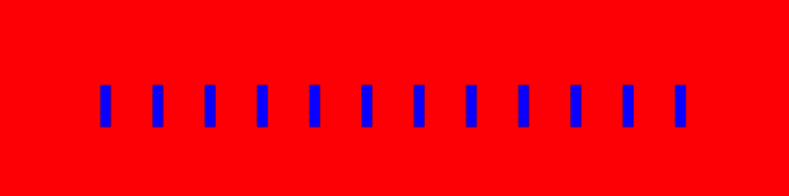
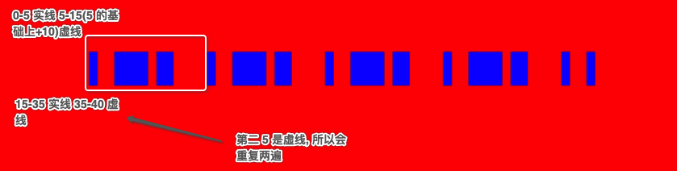

## 虚线的三个属性

- setLineDash :     [5,10] 数组是用来描述你的排列方式的
- getLineDash :   获取虚线的排列方式 获取的是不重复的那一段的排列方式
- lineDashOffset :   设置虚线的偏移位

## 绘制虚线基本用法

~~~js
<!DOCTYPE html>
<html lang="en">
<head>
    <meta charset="UTF-8">
    <title>07-Canvas虚线</title>
    
</head>
<body>
<canvas width="500" height="500"></canvas>

</body>
</html>
~~~

## 虚线的 3 值效果

~~~js

<!DOCTYPE html>
<html lang="en">
<head>
    <meta charset="UTF-8">
    <title>07-Canvas虚线</title>
    
</head>
<body>
<canvas width="500" height="500"></canvas>

</body>
</html>
~~~

