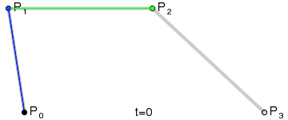

## 贝塞尔曲线

1. 从P0 - P1 是无数个点连接到一起. 形成的一条直线
2. 这些连接到一起的点 ,称之为 一次贝塞尔曲线

1. 二次贝塞尔曲线: 必须有 3 个点 有一个起点,一个终点, 一个控制点
2. 有了 3 个点就可以得到一条绿色的抛物线.
3. 
4. 2 次贝塞尔曲线的计算公式

1. 三次贝塞尔曲线: 1 个起点,1 个终点 ,2 个控制点可以得到 2 个绿色线.
2. 得到的这样的抛物线,就是三次贝塞尔曲线.
3. 
4. 三次贝塞尔曲线的计算公式

## 绘制圆弧

> - A = elliptical Arc 
> - A(rx, ry, xr, laf, sf, x, y) 从当前位置绘制弧线到指定位置
> - rx (radiux-x): 弧线X半径
> - ry (radiux-y): 弧线Y半径
> - xr (xAxis-rotation): 弧线所在椭圆旋转角度
> - laf(large-arc-flag): 是否选择弧长较长的那一段
> - sf (sweep-flag): 是否顺时针绘制x,y: 弧的终点位置

~~~html
<!DOCTYPE html>
<html lang="en">
<head>
    <meta charset="UTF-8">
    <title>08-SVG绘制圆弧</title>
    
</head>
<body>
    <!-- 
        A = elliptical Arc
        A(rx, ry, xr, laf, sf, x, y) 从当前位置绘制弧线到指定位置
        rx (radiux-x): 弧线X半径
        ry (radiux-y): 弧线Y半径
        xr (xAxis-rotation): 弧线所在椭圆旋转角度
        laf(large-arc-flag): 是否选择弧长较长的那一段
        sf (sweep-flag): 是否顺时针绘制
        x,y: 弧的终点位置
     -->
<svg width="500" height="500">
    
    <path d="M 100 100 A 100 50 0 0 0 200 150" stroke="red" fill="none"></path>
    <path d="M 100 200 A 100 50 0 1 0 200 250" stroke="red" fill="none"></path>
    <path d="M 100 300 A 100 50 0 0 1 200 350" stroke="red" fill="none"></path>
    <path d="M 100 400 A 100 50 0 1 1 200 450" stroke="red" fill="none"></path>
   
    <path d="M 100 400 A 100 50 90 1 1 200 450" stroke="red" fill="none"></path>
</svg>

</body>
</html>
~~~

## 贝塞尔曲线绘制弧线

> - Q = quadratic Bézier curve
>   - Q(x1, y1, x, y) 从当前位置绘制二次贝塞尔曲线到指定位置
>     - x1,y1: 控制点位置
>     - x,y: 终点位置
> - C = curveto
>   - C(x1, y1, x2, y2, x, y)  从当前位置绘制三次贝塞尔曲线到指定位置
>     - x1, y1: 控制点1位置
>     - x2, y2: 控制点2位置
>     - x, y: 终点位置

~~~HTML
<!DOCTYPE html>
<html lang="en">
<head>
    <meta charset="UTF-8">
    <title>09-SVG绘制贝塞尔曲线</title>
    
</head>
<body>
<svg width="500" height="500">
   <!-- 从当前位置绘制二次贝塞尔曲线到指定位置 -->
  <path d="M 100 100 Q 150 50 200 100" stroke="red" fill="none"></path>
  <!-- 从当前位置绘制三次贝塞尔曲线到指定位置 -->
  <path d="M100 100 C 100 50 200 50 200 100" stroke="red" fill="none"></path>
</svg>
</body>
</html>
~~~

