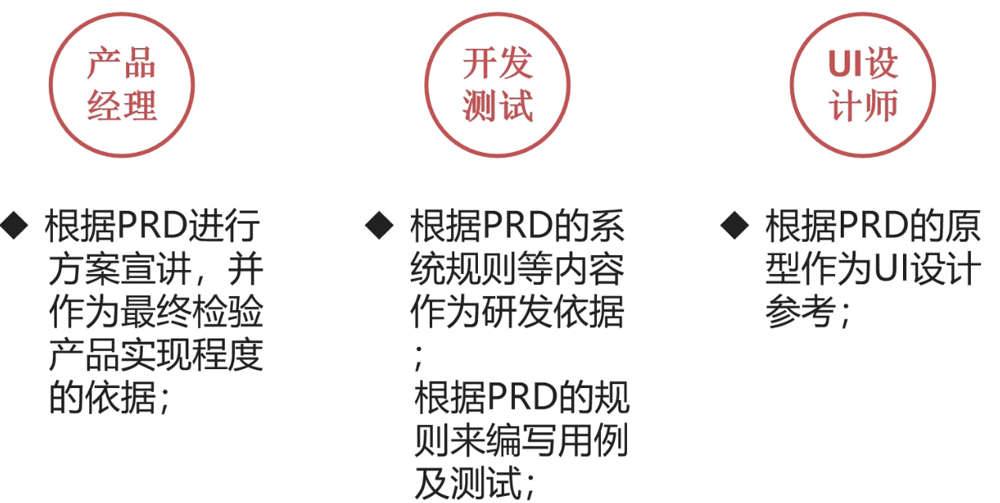
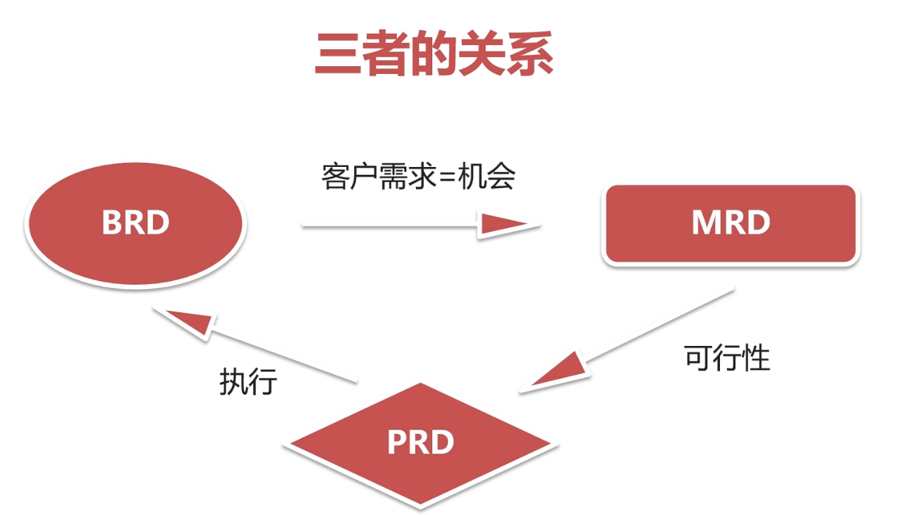

## 产品经理必备工具和网站

1. 脑图
2. 产品流程图
   1. vliso
   2. processon
3. 产品原型图
   1. 墨刀
   2. Axure
4. 产品需求文档
   1. word
   2. 石墨文档
5. 市场调研使用的网站
   1. 艾瑞,
   2. 易观
   3. 腾讯大数据
   4. 阿里研究院
   5. 国家统计局
   6. IT 桔子
6. 监控用户反馈, 用户调研
   1. 手机应用市场
   2. 问卷星
7. 查app 的下载量和迭代记录
   1. 七麦数据
   2. 酷传
8. 做数据统计
   1. 友盟
   2. 神策数据
9. 关键词趋势分析
   1. 百度指数
   2. 微信指数

## PRD 的定义

是从概念化-> 图纸化阶段的最主要的一个文档

分方向和细节

## 方向

1. 产品的定位
2. 目标市场
3. 目标用户
4. 竞争对手

## 细节

1. 产品的结构
   1. 整体结构
   2. 信息结构
   3. 功能结构
2. 核心业务流程
   1. 核心业务怎样一步一步完成,最后是否完成闭环 
3. 具体用例描述
   1. 讲清楚,怎样从这一步到那一步是怎样实现的.
   2. 两步之间的交互,包含哪些内容
4. 功能&内容描述

## PRD的作用

1. 已文档的形式准确传达需求
2. 约束产品经理, 开发
3. 验收产品质量
4. 记录产品迭代
5. 专业能力的体现

## PRD-MRD-BRD的区别

- PRD: 产品需求文档
  - Product Requirement Document
  - 用户
    - 开发
    - 测试
    - UI 设计师
  - 解决问题
    1. 产品的可视化说明
       1. 流程图
       2. 原型图
       3. 需求说明
    2. 如何实现
       1. 人
       2. 时间
    3. 体验优化
- MRD:市场需求文档
  - Market  Requirement Document
  - 用户:
    -  商务 or 运营 or 市场小伙伴
  - 解决问题
    - 产品的定位
    - 需要什么样的资源
    - 拿什么说服客户
- BRD: 商业需求文档
  - Business  Requirement Document
  - 用户
    - 老板 or 项目负责人
  - 解决痛点
    1. 需要做什么样的产品
    2. 需要哪些资源(人, 时间, 场地, 钱)
    3. 最终的走向蓝图(盈利)

BRD - 查询客户需求 -ok -> MRD 评估可行性 -ok -> PRD 出可执行方案;
