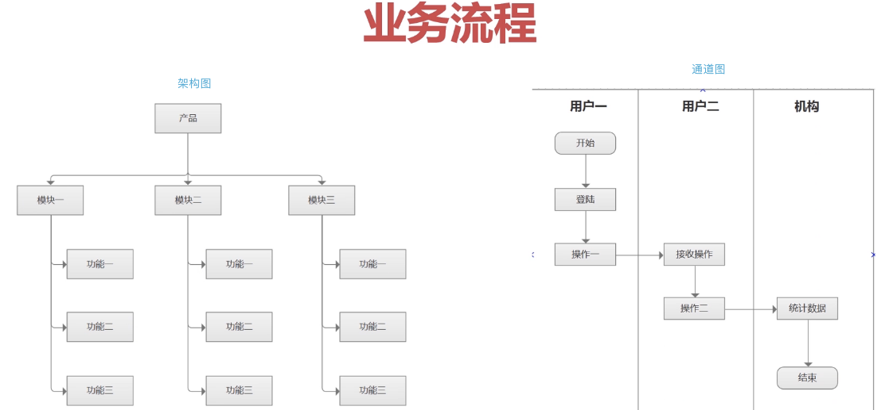
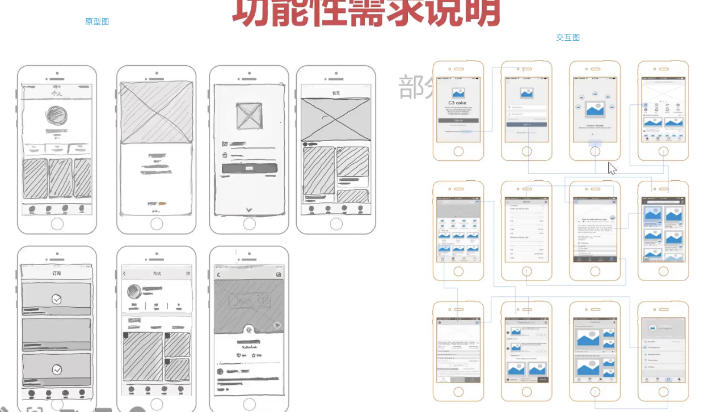
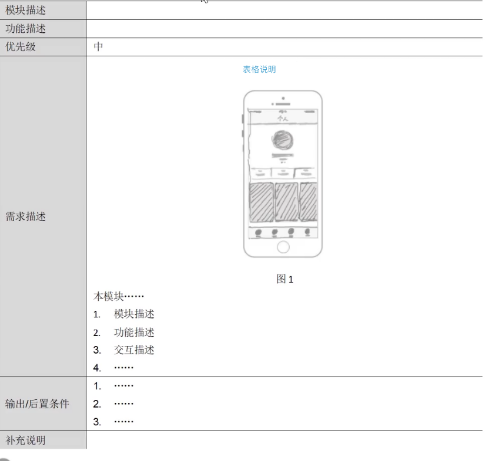

## PRD 的呈现工具

- word
  - 
- 原型软件
  - Axure
    - 支持线框图, 流程图
    - 支持文字和表格编辑
    - 有图标可以使用
  - 磨刀
    - 支持原型图和文字编辑
    - 在标号上不便捷
  - figma
    - 不支持流程图,表格,文字等编辑
    - 偏向UI设计师的工具


## PRD 组成要素

- 文档命名, 编号,历史版本,目录,引言,需求概述,功能描述,非功能说明


- 命名, 编号

  - 命名规则和编号的约定规则

    - 示例

      ```ts
      XX产品V1.0 PRD_V2
      ```

      

- 版本历史, 目录

  - 每个版本的更新内容,更新人, 所在目录

  - 示例

    | 文档版本号 | V2.1           | 文档编号:     | 1.0  |
    | ---------- | -------------- | ------------- | ---- |
    | 文档密级:  | 项目组成员可见 | 归属部门/项目 |      |
    | 产品名:    | 慕课网         | 子系统名:     |      |
    | 编写人:    | Neal           | 编写日期:     |      |

  - 修订记录

    | 版本号 | 修订人 | 修订日期 | 修订描述 |
    | ------ | ------ | -------- | -------- |
    |        |        |          |          |
    |        |        |          |          |
    |        |        |          |          |

    

- 引言

  - 产品研发的背景, 市场趋势,发展前景
    - 市场调研相关的信息,为决策人提供足够的信息用户决策
  - 产品研发的目的, 意义
  - 预期读者
    - 该文档的阅读对象
  - 产品规划
    - 该产品每一个阶段的迭代目标,开发及 UI 在初期要达到的效果
  - 名词解释
    - 对新词汇进行解释说明
  - 该文档的参考资料

- 需求概述

  - 业务流程 - 可以使用流程图, 架构图, 通道图

    - 

  - 用户角色, 

    - | 用户类型 | 用户描述                      |
      | -------- | ----------------------------- |
      | 类型一   | 所有......的用户              |
      | 类型二   | 所有使用.....的机构用户       |
      | 类型三   | 主要使用...功能进行....的用户 |
      | 类型四   | 主要是用....功能和服务的用户  |

      

  - 功能清单: 主要给开发使用

    - | 功能模块 | 主要功能点                             | 优先级                     |
      | -------- | -------------------------------------- | -------------------------- |
      | 模块一   | 功能1<br />功能2<br />功能3<br />功能4 | 高<br />中<br />中<br />高 |
      | 模块二   | 功能1                                  | 低                         |
      | 功能三   | 功能1                                  | 中                         |

      

  - 运行环境

    - 运行的环境, 支持的浏览器, 版本等等

  - 产品规划

    - 对于 PRD 中开发的内容, 给出关键里程碑, 
    - 比如: 
      - 需求评审的时间
      - 开发的完成时间
      - 上线时间
    - 描述产品可能存在的风险,
      - 性能瓶颈
      - 没有解决的问题
      - 用户不当使用的风险

- 功能性需求说明

  1. 简要说明:介绍此功能的用途, 包括其来源或背景,能够解决哪些问题
  2. 场景描述, 产品在那种情况下会被用户使用, 就是用户场景模拟.

  - | 用户场景 | 描述用户操作场景,如: 用户从首页登录 |
    | -------- | ----------------------------------- |
    | 功能描述 | 描述该场景下的功能特性              |

  3. 业务规则:
     1. 每种产品在开发时都有相应的业务规则
        1. 让开发和测试人员能够直观的明白该规则,且没有产生歧义
        2. 完整,准确,易懂
  4. 原型图
     1. 
        1. 交互需要把每个跳转都书写清楚,有哪些前置条件
  5. 前置条件
     1. 例如: 上传照片的前置条件,是需要存有图像文件
  6. 后置条件处理
     1. 例如: 上传图片会因为没有网络, 图片太大导致上传失败
     2. 或者上传成功有哪些提示
  7. 

- 非功能描述

  - 性能需求
    - 并发性能, 相应性能, 安全性能,预期效果描述
    - 需求变更的计划
      - 实际开发中无法实现的功能等情况,需要变更原有计划
  - 运营需求
    - 产品上线后如何运营
    - 目标受众是什么
    - 建议的推广策略
    - 问题反馈路径
    - 风险监控
    - 亮点宣传等等
    - 与运营人员的协作方式
  - 风险分析
    - 对产品上线后可能遇到的风险,问题进行可能性,严重性的分析,并提出应对策略,保持产品的持续运营


## PRD 编写原则

- 贴合团队实际情况
- 清晰, 有效

## 总结

- 做好功能关联性,避免功能模块缺失
  1. 在组织结构时, 开始时不要陷入细节,从打到小进行组织, 先出一个组织架构图
  2. 从场景出发
     1. 从场景功能出发, 查看是否合理
     2. 对场景下的功能进行描述
  3. 对照产品,按页面顺序罗列功能点,然后往框架里面丢