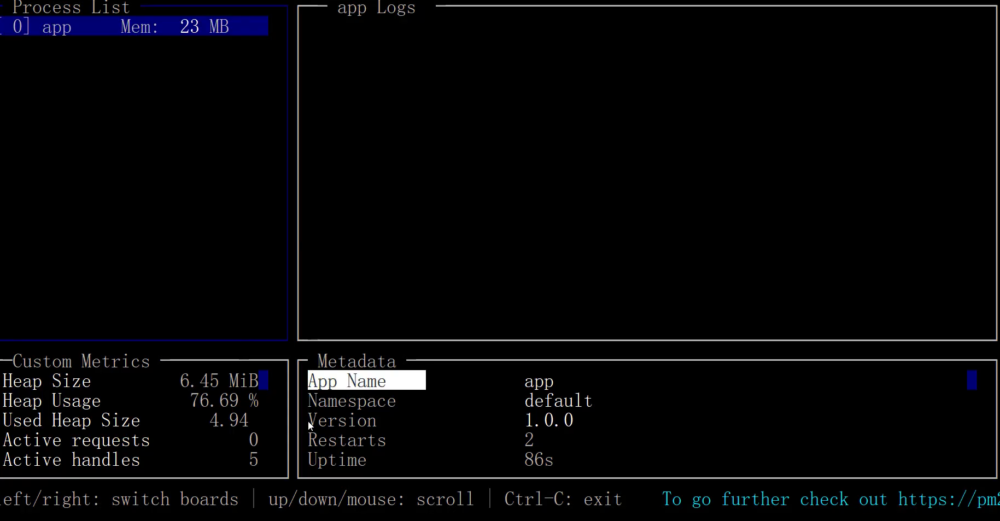

## 如何上线Node编写的项目?

### 上线项目需要考虑的几个问题

1. 服务稳定性, 不会因为程序的某个错误或异常导致项目停止服务
2. 线上日志记录, 除了记录访问日志以外, 我们还需要记录错误日志和自定义日志
3. 充分利用服务器资源, Node是单线程的, 服务器是多核的, 一台服务器只运行一个Node程序太浪费资源


### 如何解决上述问题?

- 通过PM2
  1. PM2的进程守护可以在**程序崩溃后自动重启**
  2. PM2自带日志记录的功能, 可以很方便的记录错误日志和自定义日志
  3. PM2能够启动多个Node进程, 充分利用服务器资源


3.PM2使用

```shell
# 全局安装
npm install pm2 -g
# 查看版本,确认安装成功
pm2 --version
# 启动
pm2 start app.js
```


## 常用命令

```js
pm2 start app.js|config     // 启动应用程序
pm2 list                    // 列出启动的所有的应用程序
pm2 restart appName|appId   // 重启应用程序
pm2 info appName|appId      // 查看应用程序详细信息
pm2 log appName|appId       // 显示指定应用程序的日志
pm2 monit appName|appId     // 监控应用程序
pm2 stop appName|appId      // 停止应用程序
pm2 delete appName|appId    // 关闭并删除所有应用
```

## 示例

`pm2 list`

打印启动的程序列表

| id   | name | mode | 重启次数 | status(状态) | cpu  | memory |
| ---- | ---- | ---- | -------- | ------------ | ---- | ------ |
| 0    | app  | fork | 0        | online(在线) | 0.5% | 22.2mb |

`pm2 info app`

打印 app 程序的详细信息


## 日志

- 如果是通过pm2来启动Node项目, 那么会自动将log输出的内容记录到自定义日志当中
- 程序中 `cosole.log()` 打印的都会被 pm2 log 获取

```js
// log 自定义日志
console.log('接收到请求'); 
// error 日志
console.error('我是错误日志');
```

- 上面的日志 , 会自动记录到 `pm2 info app` 中
  - `error log path` :  错误日志路径
  - out log path : 自定义日志路径


## 监控程序示例

- `pm2 monit app`     // 监控应用程序
- 会现实如下信息 




## 停止app

`pm2 stop appName|appId`      // 停止应用程序后, 会从app 列表中消失
