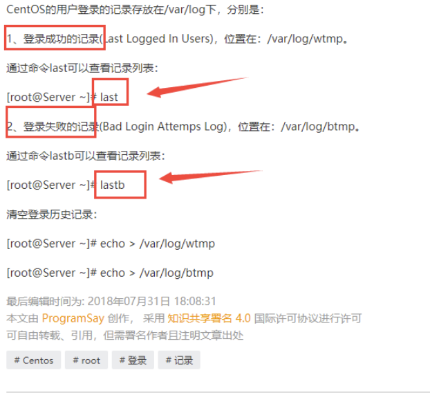

## ssh 密码登录

```shell
ssh -p 22 root@122.51.64.91 
# 在输入密码
```

##  ssh 密钥登录

```shell
# 修改权限仅能本人访问
chmod 400 path/密钥名.prem
#登录
# ssh -i /path/密钥名.pem  用户名@IP
ssh -i /path/密钥名.pem  root@122.51.64.91
```


## 防火墙放行指定端口

```shell
#命令 ： 端口号： 10050
firewall-cmd --zone=public --add-port=10050/tcp --permanent
firewall-cmd --reload
#两个命令均返回 : success 说明成功
#查看防火墙是否运行
firewall-cmd --state
# 返回 running 说明放行
```

## 关闭进程

````shell

lsof -i :80
kill 
# 下面这个可以保护存储类程序, 未测试
killall mongod 
````

## mac 和云服务器之间传输文件

```shell
# 服务器IP可以用域名代替
#上传语法：scp /本地文件路径/本地文件名 服务器用户名@服务器IP:路径
#下载语法：scp 服务器用户名@服务器IP:路径/文件名 /本地文件路径
#上传文件夹 ：scp -r /Users/ElonJ
	
	
elinek/Desktop/newDir aliyun@batbatbat.com:
# 下载文件夹：scp -r aliyun@batbatbat.com:newDir /Users/ElonJelinek/Desktop/
```


## 云服务器重装系统后无法登陆的问题

```shell
ssh-keygen -R 伺服器端的IP或網址
```

## 【Linux】设置ssh远程连接超时时间

```shell
vim /etc/ssh/sshd_config
#找到以下两项配置 : 24小时
#ClientAliveInterval 0
#ClientAliveCountMax 3
#修改为
ClientAliveInterval 30
ClientAliveCountMax 86400
# 1、客户端每隔多少秒向服务发送一个心跳数据
# 2、客户端多少秒没有相应，服务器自动断掉连接
```


## 查看某个软件包所有相关目录和配置文件

```shell
# nginx 是安装包名
rpm -ql nginx
```


## 访问网站

```shell
# curl 网址 因为 linux 不会渲染所以得到的是 html 页面的代码
curl https://www.baidu.com

# 查看请求信息并 重定向到一个位置
curl -v https://www.baidu.com >/dev/null


```

## 备份文件

```shell
# cp 需要备份的文件名 备份路径+新的文件名
cp defalut.conf /opt/backup/default.conf_bak
```


## 重命名

```shell
# mv 原文件 新文件
mv default.conf vserver1.conf
```


## 查看端口使用情况

```shell
ss -luntp
 
# 或 

netstat -luntp
```


## 查看Linux 服务器当前的访问连接

```shell
#看下当前的连接记录
netstat -an
```


