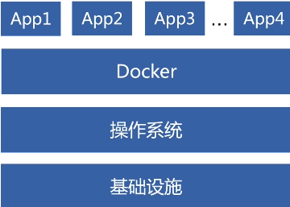
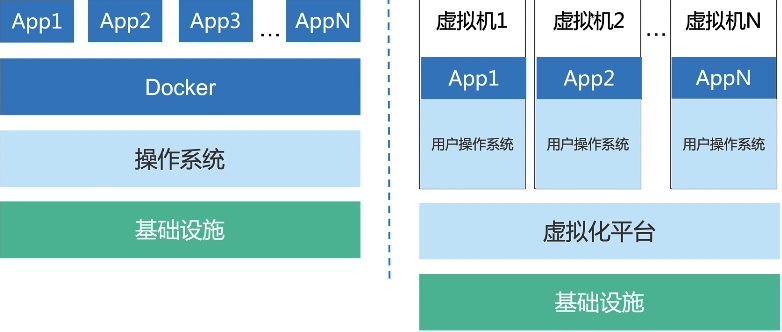

## 概念

**和虚拟机的区别**

## 特性

> 文件、资源、网络隔离
>
> 变更管理、日志记录
>
> 写时复制：多个 app 可以访问同一个资源，只有当 app 们有不同需求时他们才产生一个副本；
>
> 解释：4 个 app 都访问 Docker 下的 a.js 文件。a.js 就一份。当 app1 突然要对 a.js 产生修改。此时 Docker 在会产生一个针对 app1 需要的 a.js文件的副本。  