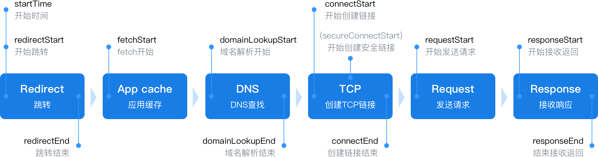
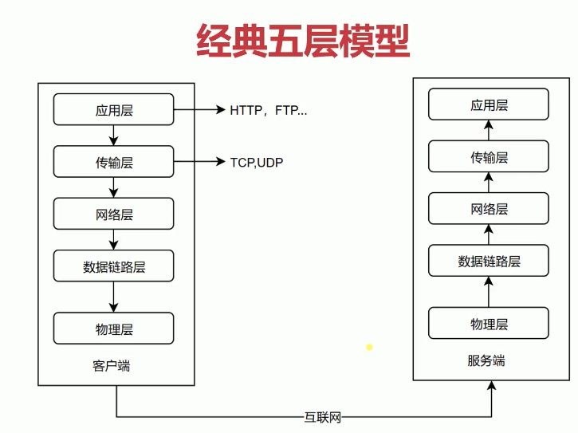
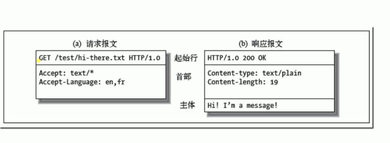

# 基础

>  浏览器输入URL后HTTP请求返回的完整过程

DNS: 域名解析为IP地址

TCP : 三次握手

## # 经典五层模型

> 每层是干什么的

> 主要将应用层 + 少量传输层
>
> 传输层 TCP/IP 协议

### 下三层

##### 物理层:

>  定义物理设备输入传输数据,从一个物理设备向另一个物理设备传输

##### 数据链路层:

> 在通信的实体间建立数据链路.让设备识别相近的设备确定一个转接点是谁,把数据传过去

#####  网络层

> 例如从自己电脑到百度服务器之间链接, 如何建立一个有效的网络中的逻辑路径.从而实现真实的自己设备通过一系列设备最终于百度服务器实现数据交互.
>
> 创建逻辑链路.

###  上两层

####  传输层

> 确定端对端的传输, TCP/IP 协议就是做这个的. ,约定了数据如何处理数据的各种问题, 如数据拆分,合并, 向下封装全部的内容,向上提供接口给应用层使用等等

#### 应用层

> http协议 ,ftp 协议 ,https协议 ,面向软件提供api接口供开发使用. 构建与TCP协议之上.

##  HTTP 历史

### 0.9 版本

1. 只有一个命令 GET
2. 没有HEADER等描述数据的信息
3. 服务器发送完毕,就关闭TCP连接

### 1.0 版本

1. 增加了很多命令: POST 等等
2. 增加 status code 和header
   1. status code 是描述服务器处理请求后,它的状态
   2. header  发送请求和接受请求的数据,对这个数据进行一个描述说明
3. 多字符集支持, 多部分发送, 权限,缓存等

### 1.1 版本

1. 增加功能: 持久链接
2. pipeline : 同一个链接,发送多个请求.
3. 增加 host 和其他一些命令;
   1. host : 可以同一台物理服务器上可以跑多个web服务器, 通过host 可以明确在同一个物理服务器上访问的是具体哪个web服务器软件.

### HTTP 2

> ? 没有普及

1. 所有数据已二进制传输, HTTP 1是字符串
2. 同一个连接里面发送多个请求,不在需要按顺序处理
3. 头信息压缩以及推送等提高效率的功能

## HTTP 3次握手

> 逻辑

1. 客户端想开启一个请求窗口,想服务器发送建立连接的请求.第一次握手
2. 服务器收到请求,服务器开启一个窗口, 告诉客户端我准备地方和你传输数据了. 第二次握手
3. 客户端收到服务端的后,再次告诉服务端,好的我收到你的确认信息了. 第三次握手.

**综述:** : 每一次网络请求都需要消耗客户端和服务端的资源,但是网络环境是复杂和不确定的,如果不进行确认,双方都预留一个窗口,却不关闭窗口始终等待,那么就有可能开启太多窗口,特别是服务器, 如果没有客户端的第三次握手,会一直开启一个多余窗口消耗资源.

## URI, URL, URN

> 

#### URI 

> Uniform Resource Identifier/ 统一资源标志符
>
> 用来唯一标识互联网上的信息资源. 
>
> URI 包含了 URL 和 URN

### URL

> Uniform Resource Locator/ 统一资源定位器

~~~js
完整URL 说明
http:// user:pass@host.com:80/path?query=string#hash
http: 数据传输采用的协议
user:pass : 用来验证用户可靠性,但实际上有更好的方式,所以并没有使用.知识url预留出这个位置了
host.com: 服务器在互联网中的位置, ip地址或域名之类的. 物理服务器的地址
80: 端口号,指明要找这个物理服务器中的哪个web服务器.每个端口都是服务器app向外界链接道路.所以一个app就有一个独立的端口号
path: 路由,通过路由定位到具体资源的路径位置.
?query=string : 搜索参数,通过参数进一步说明我要具体什么数据
#hash: 定位某个文档的片段,在实际开发中作为锚点来定位具体数据的位置.
~~~

### URN

> 用的不多,了解.
>
> 永久统一资源定位符
>
> 发明的目的是希望资源被移动之后还能被找到,但是并没有成熟的使用方案

## HTTP 报文

> http 从语义上建议你遵守某些规则,但是不是强制约束你这么做

**a: 请求报文**

1. 首行包括 3 个部分
   1. 请求方式: get,post,put,delete,copy 等等 代表了不同的语义
   2. url: 发送请求,链接已经建立,所以不需要前面的信息,直接告诉具体地址就行
   3. 协议版本, 一般来说现在都是HTTP1.0
2. 首部: 请求头

**b: 响应报文**

1. 首行包括 3 个部分
   1. 协议版本
   2. status code 说明服务器的状态
   3. ok : code 对应的文本说明
2. 首部: 响应头
3. 主体: body , body和首部的区分方式 中间有一个完整的空行,不仅仅是回车

## HTTP 方法

> 常用的: GET , POST   , 此处HTTP更强调语义化. 

## HTTP CODE

> 定义服务器对请求的处理结果
>
> 不同区间的CODE 有各自的语义 ,望文生义是好的code提示

## HTTP 的跨域

#### 解析类型

> 请求头中"Content-Type"类型 的值是告诉接收端怎样解析内容.

~~~js
https://www.runoob.com/http/http-content-type.html

# 常见的媒体格式类型如下：

text/html ： HTML格式
text/plain ：纯文本格式
text/xml ： XML格式
image/gif ：gif图片格式
image/jpeg ：jpg图片格式
image/png：png图片格式

# 以application开头的媒体格式类型：

application/xhtml+xml ：XHTML格式
application/xml： XML数据格式
application/atom+xml ：Atom XML聚合格式
application/json： JSON数据格式
application/pdf：pdf格式
application/msword ： Word文档格式
application/octet-stream ： 二进制流数据（如常见的文件下载）
application/x-www-form-urlencoded ： <form encType=””>中默认的encType，form表单数据被编码为key/value格式发送到服务器（表单默认的提交数据的格式）
另外一种常见的媒体格式是上传文件之时使用的：

multipart/form-data ： 需要在表单中进行文件上传时，就需要使用该格式
~~~

#### 预请求

> 限制

1. 请求方式 :
   1. GET / HEAD / POST 三个请求是不需要预请求, 其他浏览器会主动发送预请求
2. 解析类型: content-type
   1. text/plain
   2. multipart/form-data
   3. application/x-www-form-urlencoded
   4. 以上三种类型之外,浏览器也会主动发送预请求
3. 请求头限制: 请求设置了自定义的header字段
   1. XMLTttprequestUpload 对象均没有注册任何事件监听器
   2. 请求中没有使用 ReadableStream 对象
4. 网页说明: https://fetch.spec.whatwg.org/#cors-safelisted-request-header

> 

