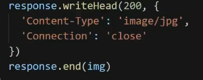

# HTTP 长连接

> ​	当网站有大量资源需要和服务器进行交互, 保持长连接则可以更节省资源.
>
> 避免了每次都请求3次握手,从而提高效率.

## 长连接的逻辑

1. 谷歌浏览器允许并发最多6个并发链接,再多就会复用.
2. 创建长连接: 在请求头里面 Response Headers中 Connection:kepp-Alive,代表整个链接在请求后保持链接.
3. 在响应头里,服务器如果允许长连接: Requset Headers 中 Connection:kepp-Alive 会有值, 但是服务器也可以选择保持
   1. 服务器默认在获得长连接请求的时候,会保持. 如果不允许需要手动关闭 connection: close
   2. 

