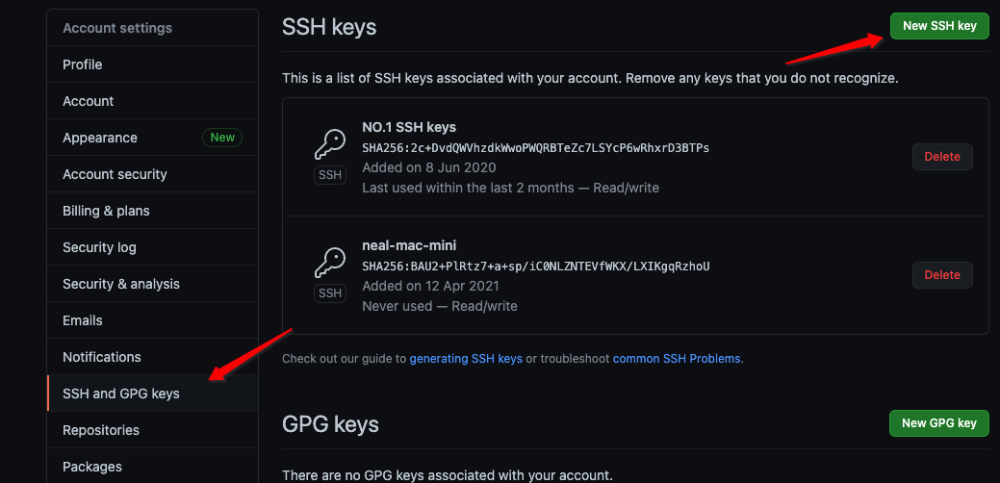
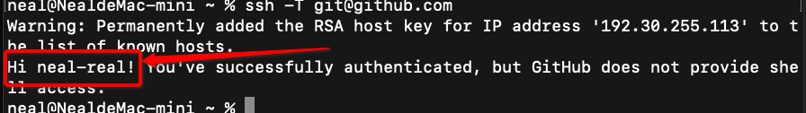

## ssh配置方法

https://gitee.com/help/articles/4181

1. 创建公钥

```
ssh-keygen -t rsa -C "xxxxx@xxxxx.com"  
```

2. 三次回车
3. 出现成功图形

4. 打印公钥字符串

   > 不要复制空格

```
cat ~/.ssh/id_rsa.pub
```

5. 复制到 github 网站的 ssh and GPG keys 中 创建新的 SSH key

   

6. 终端输入指令

   1. ssh -T git@github.com
   2. 如果出现yes/no 选 yes
   3. 出现 Hi 用户名 这配置成功

   

7. 下载项目

   1. 使用SSH git clone git@github.com:neal-real/Neal-Tools.git

8. 配置用户名称和邮箱

   