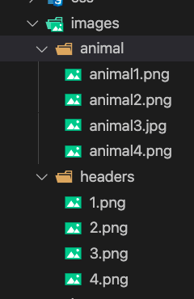

## 什么是合并图片?

- webpack之后我们只需要让"UI设计师"给我们提供切割好的图片

  我们可以自己合成精灵图, 并且还不用手动去设置图片的位置

## 如何合并图片

- 有两个插件都可以合并图片
- ` postcss-sprites`  https://www.npmjs.com/package/postcss-sprites
- `webpack-spritesmith` https://www.npmjs.com/package/webpack-spritesmith

## Postcss-sprites

### 安装

```js
// 前提已经安装 postcss
npm install --save-d postcss-sprites postcss
```

### 配置

配置写在 postcss.config.js 中, 如果没有这在根路径下创建

- spritePath 合并后的图片保存在什么位置

```js
module.exports = {
  plugins: {
    "postcss-sprites": {
      // 告诉webpack合并之后的图片保存到什么地方
      spritePath: "./bundle/images",
      // 告诉webpack合并图片的时候如何分组(因为默认会将所有图片打包到一个图片中)
      groupBy: function (image) {
        // 打印 image 对象的 url 的值 : '../images/animal/animal1.png',
        // 截取路径 根据图片的上级目录作为打包图片的名称
        let path = image.url.substr(0, image.url.lastIndexOf("/"));
        // console.log(path, "!!!!!!");
        let name = path.substr(path.lastIndexOf("/") + 1);
        // console.log(name, "!!!!!!!!");
        return Promise.resolve(name);
      },
      // 判断哪些图片需要打包,哪些图片不需要打包
      filterBy: function (image) {
        /* 通过这方法,可以在图片名称结尾添加 ?字符 的方式区别图片,
        	 然后在这里判断进行是否的合并的
        */
        let path = image.url;
        // 通过正则,png 结尾的不合并.
        if(!/\.png$/.test(path)){
          return Promise.reject();
        }
        // 非 png 结尾的图片,合并
        return Promise.resolve();
      }
    }
  }
};

```

上级目录的结构



### 配置 webpack文件

wbpack.config.js 的配置文件,找到图片打包文件的配置项,添加 publicPath 字段

```js
// 打包图片规则
{
  test: /\.(png|jpg|gif)$/,
    use: [
      {
        loader: 'url-loader',
        options: {
          // 指定图片限制的大小
          limit: 1024,
          // 指定打包后文件名称
          name: '[name].[ext]',
          // 指定打包后文件存放目录
          outputPath: 'images/',
          // 在这里配置一个路径,配置图片前的绝对路径
          publicPath: "http://localhost:63342/Git-Webpack/Webpack/34-webpack-图片合并/bundle/images"
        }
      },
      {
        loader: 'image-webpack-loader',
        options: {
          mozjpeg: {
            progressive: true,
            quality: 65
          },
          // optipng.enabled: false will disable optipng
          optipng: {
            enabled: false,
          },
          pngquant: {
            quality: [0.65, 0.90],
            speed: 4
          },
          gifsicle: {
            interlaced: false,
          },
          // the webp option will enable WEBP
          webp: {
            quality: 75
          }
        }
      },
    ]
},
```


## 使用

1. 在 css 使用背景图
2. 在 js 中引入 css 文件 


## webpack打包图片路径问题

1. 在开发阶段将publicPath设置为dev-server服务器地址
2. 在上线阶段将publicPath设置为线上服务器地址
3. 在 webpack 配置文件找到图片打包色设置的 url-loader

```js
// 打包图片规则
{
  test: /\.(png|jpg|gif)$/,
    use: [
      {
        loader: 'url-loader',
        options: {
          // 指定图片限制的大小
          limit: 1024,
          // 指定打包后文件名称
          name: '[name].[ext]',
          // 指定打包后文件存放目录
          outputPath: 'images/',
          // 在这里设置
          publicPath: "http://127.0.0.1:9090/images"
        }
      },
```


