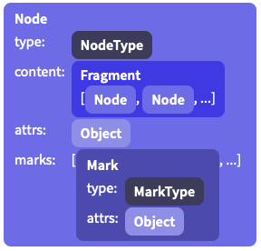

## 文档内容的处理

- 每个 state 对象上有一个 doc 属性, doc 是一个只读类的数据. doc 属性中的数据结构类似 浏览器中的 DOM 节点, 
- 举例: 一个简单的文档可能仅一个 doc 节点, 它包含2个 "paragraph" 节点, 每个 "paragraph" 节点又包含一个 "text" 节点


> 在创建一个新的 state 的时候, 你可以传给 state 任意的表述内容的`(Schema)`数据结构. 

```js
import {DOMParser} from "prosemirror-model"
import {EditorState} from "prosemirror-state"
import {schema} from "prosemirror-schema-basic"

let content = document.getElementById("content")
// 按照 schema 中的格式去解析指定的内容;
let state = EditorState.create({
  doc: DOMParser.fromSchema(schema).parse(content)
})
```


## 文档

PM 默认使用自己的`(schema)`数据结构去解析内容生成文档, 所以有必要了解 PM 是怎样构建文档的.


##  文档结构

> - PM 文档是一个节点类型的数据，它包含`0-N`个子节点构成的节点树. 这个类似 DOM 树的结构,
> - PM 由块节点和行内节点两种主要的区别.

### 在行内元素的存储上使用平面序列;

> - 这样的好处,是可以使用偏移量进行标记,操作. 比起通过节点路径说明位置,并操作方式要简单并高效很多.

示例:

~~~html
<!-- 这是一段 HTML 代码 -->
<p>This is <strong>strong text with <em>emphasis</em></strong></p>

<!-- HTML 中结构的表示方式是: -->
<p> "this is "
 						<strong> "strong text with "
																	     <em> "emphasis" </em>
            </strong>
</p>
<!-- 在 PM 节点中的表示方式 -->
			 "this is "    | "strong text with" | "emphasis"
<!-- "strong(Mark)"     "strong(Mark)",     "em(Mark)" -->
~~~


**节点对象有一些常用的属性,来对节点进行识别**

- `isBlock` 和  `isInline 可以判断节点是快节点 还是行内节点
- `inlineContent` 布尔取值; true 表示节点仅接受行内内容作为内容`(子节点)`
- `isTextblock`  布尔取值;  true 表示判断的节点是一个含有 inlineContent 的块节点.
- `isLeaf` 表示此节点不允许包含任何内容`(子节点)`

通过这些可以在 Schema 的数据结构中,更加精确的约束一个写节点中可以有什么子节点.并给节点起一个类型名称用于区分.

### PM 在块状节点上使用

- 在 DOM 中, nodes(节点) 是带有 ID 表示的 mutable 对象(可变对象),这说明了两件事;
  - 1. 一个节点永远和另一个节点出去嵌套关系.
    2. 一个节点的数据更新, 内容就更新.这就是可变对象.

- PM 中nodes(节点) 是不可变的 values, 
  - 示例: 一个节点 = 常量; 当对节点进行更新,是在原有的基础上进行变更得到一个新的节点,而不是原有的节点的数据发生变化.
  - PM 文档的机制. 它的值不会改变, 而且可以被当做一个原始值去计算一个新的文档;
  - 多次强调 节点是 values, 不是拥有状态的对象.
- 表明: 每次你更新文档, 你就会得到一个新的文档. 这个新的文档共享旧的文档所有没有在这次更新中改变的子节点的 value.
- 这种机制的优点,使得 state 和 state 之间处于一种简单变化关系,避免了 DOM 节点的变化带来的复杂性思考. 同时为协同编辑成为可能.


> 注意点:   nodes(节点) 使用了正常的 JavaScript 对象,并未使用 [freezing](https://developer.mozilla.org/en-US/docs/Web/JavaScript/Reference/Global_Objects/Object/freeze)  属性,因为使用他非常影响性能. 所以事实上 PM 的文档是可变的, 你也可以手动修改它们. PM 不支持这样做, 强行操作可能会引起崩溃.
>
> 同时注意 node 对象上存储的数组和对象同样适用,此规则, 比如 node attributes 对象, 或者存在 fragments 上的子 nodes(节点).


## PM 文档对象结构如下


~~~js
Node:
    type: NodeType //包含了Node的名字与属性等
    content: Fragment:[node,node,...] //包含多个Node
    attrs: Object //自定义属性，image可以用来存储src等。
    marks: [Mark, Mark...] // 包含一组Mark实例的数组，例如em和strong
Mark:
    type: MarkType //包含Mark的名字与属性等
    attrs: Object //自定义属性
~~~



## 说明

1. 每个节点都是 [节点类型对象](https://prosemirror.net/docs/ref/#model.Node)的实例, 它们 之间使用 [type](https://prosemirror.net/docs/ref/#model.NodeType) 属性进行分类;
   1. NodeType 中有 type 的名称, Schema 结构, 等等其他信息.
2. 节点的子节点保存在 content 属性下; 它已 [`Fragment`](https://prosemirror.net/docs/ref/#model.Fragment) 类型的数据结构保存.
   1. 它是一个数组, 无论content 内是否有子节点. 另外如果是 空节点,那么是 [empty fragment](https://prosemirror.net/docs/ref/#model.Fragment^empty) 类型;空类型也是共享类型
3. 节点可以添加额外的字段:`attributes`, 这个字段保存在每个节点上,用来给一些节点使用, 例如 图片 image 节点可以保存 alt 文本和 URL 连接.
4. 节点还有一个字典: `marks` , 这个字段用来标记行内信息, 例如 : 加粗,链接,等情况.
5. 总之一个完整的文档就是一个复杂或简单节点. 内容即可以是复杂的很多个块节点组成也可以是简单只有一个文本块,里面包含一个行内节点.
6. 文档中节点的类型是有 [schema](https://prosemirror.net/docs/guide/#schema) 决定的

````js
import {schema} from "prosemirror-schema-basic"

// null 参数的位置是你可以指定属性的位置.
let doc = schema.node("doc", null, [
  schema.node("paragraph", null, [schema.text("One.")]),
  schema.node("horizontal_rule"),
  schema.node("paragraph", null, [schema.text("Two!")])
])
````


### prosemirror提供了两种类型的索引

1. 树类型，这个和dom结构相似，你可以利用`child`或者`childCount`等方法直接访问到子节点
2. 平坦的标记序列，它将标记序列中的索引作为文档的位置，它们是一种计数约定,在标记内容特定位置是特别有用.
3. 每个节点都有一个 nodeSize 属性, 通过 [Fragment](https://prosemirror.net/docs/ref/#model.Fragment) 类 的 size 属性获得;
   1. 请注意，对于根节点, 文档的大小是doc.content.size，而不是doc.nodsize。因为光标不可能在根节点之外所以是根节点的大小,而不是根节点内容的大小

4.  [`Node.resolve`](https://prosemirror.net/docs/ref/#model.Node.resolve) 可以让你避免过量复杂的计算来得到位置, 此方法可以得到当前位置的父节点,它在父节点的偏移量,和其他一些必要的信息
5. 在关于位置的索引上,需要注意区分  [`childCount`](https://prosemirror.net/docs/ref/#model.Node.childCount) 和 child 索引,  [`childCount`](https://prosemirror.net/docs/ref/#model.Node.childCount) 是拥有多少个子节点的计数.

~~~html
1. 在整个文档开头，索引位置为0
2. 进入或离开一个不是叶节点的节点记为一个标记
3. 文本节点中的每个节点都算一个标记
4. 没有内容的叶节点(例如image)也算一个标记

例如有一个HTML片段为
0    1  2  3   4     5 
	<p>  O  n  e   </p>
5							 6    7   8   9  10      11     12              13
  <blockquote>   <p>  T   w   o      </p>   </blockquote>
~~~


## 选区片段[`Slice`](https://prosemirror.net/docs/ref/#model.Slice) 

- 对于用户的复制粘贴和拖拽之类的操作, 涉及到一个叫做选区片段的概念, 两个位置之间的内容就是`选区片段`
- 选区片段和节点或者 fragment 类型节点集不同, 它会出现 HTML 标签片段的情况, 标签和标签之间无法闭合.
  - 即从一个节点中间开始,到另一个节点的某个位置结束,即包含了上个节点的结束标记,又包含了结束节点的开始标记.
- [`Slice`](https://prosemirror.net/docs/ref/#model.Slice) 数据结构就用来表示这种情况的

````js
//假设文档有两个 p 标签, 第一个 p 标签包含 a, 另一个 p 标签包含 b, 即:
// <p>a</p><p>b</p>
let slice1 = doc.slice(0, 3) //开始的 paragraph(段落)
console.log(slice1.openStart, slice1.openEnd) // → 0 0
let slice2 = doc.slice(1, 5) // 从开始的 paragraph(段落)
                            // 到结束的 第二个标签
console.log(slice2.openStart, slice2.openEnd) // → 1 1
````


## 数据变化

1. 因为节点和 fragment 是一种长期存储的数据结构,不合适直接修改他们, 如果你需要操作文档, 最好的方法就是基于原有的文档产生一份新的文档. 
2. 所以推荐大多树情况, 需要使用  [transformations](https://prosemirror.net/docs/guide/#transform) 去更新文档. 千万不要直接修改节点. 这也方便留一下一个变化的记录.而记录也是编辑器 state 的一部分.
3. 特殊情况下, 一定要修改, PM 在 [Node](http://prosemirror.net/docs/ref/#model.Node) 和 [Fragment](http://prosemirror.net/docs/ref/#model.Fragment) 上提供了一些辅助函数,帮助你创建一个全新的文档. 例如: [Node.replace](http://prosemirror.net/docs/ref/#model.Node.replace) 方法,  content 的 [slice](http://prosemirror.net/docs/ref/#model.Slice) 替换指定文档范围的内容. 
4. 也可以用 [copy](http://prosemirror.net/docs/ref/#model.Node.copy) 方法, 创建一个新节点, 此节点可以指定新的子节点集
5. Fragments 类中也有更新文档的方法, 例如:  [replaceChild](http://prosemirror.net/docs/ref/#model.Fragment.replaceChild) 和 [append](http://prosemirror.net/docs/ref/#model.Fragment.append).