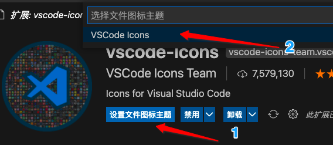
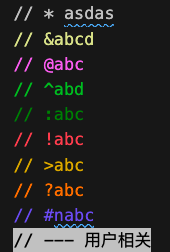

## 文件夹图标

**vscode-icons**




## 注释颜色配置

### Better Comments



~~~javascript
Better Comments  //自定义注释的颜色 
## 自定义的方法在settings.json里添加字段 ,tag是标志,颜色是指定颜色
{
            "tag": "@",
            "color": "#EE82EE",
            "strikethrough": false,
            "backgroundColor": "#transparent"
        },
        {
            "tag": "^",
            "color": "#44C044",
            "strikethrough": false,
            "backgroundColor": "transparent"
        },
        {
            "tag": ":",
            "color": "#228B22",
            "strikethrough": false,
            "backgroundColor": "transparent"
        },
        {
            "tag": "?",
            "color": "#FF8C00",
            "strikethrough": false,
            "backgroundColor": "70dde9d5"
        },
        {
            "tag": ">",
            "color": "#DCB600",
            "strikethrough": false,
            "backgroundColor": "transparent"
        },
        {
            "tag": "!",
            "color": "#FF6666",
            "strikethrough": false,
            "backgroundColor": "transparent"
        },
        {
            "tag": "&",
            "color": "#E2E6A2",
            "strikethrough": false,
            "backgroundColor": "transparent"
        },
        {
            "tag": "*",
            "color": "#CCCCCC",
            "strikethrough": false,
            "backgroundColor": "transparent"
        },
        {
            "tag": "#",
            "color": "#7B68EE",
            "strikethrough": false,
            "backgroundColor": "transparent"
        },
        {
            "tag": "-",
            "color": "#000",
            "strikethrough": false,
            "backgroundColor": "#ccc"
        },
~~~


## Turbo Console Log

> 选中生成 console.log() 

```html
ctrl+shift+l (L l 不是 I i)
注释log：  alt + shift + c
启用log：  alt + shift + u
删除log:   alt + shift + d
```

### 扩展配置


| 作用                                                         | 配置项                                              |
| ------------------------------------------------------------ | --------------------------------------------------- |
| 是否包装日志消息                                             | turboConsoleLog.wrapLogMessage（布尔值）            |
| 双引号（“”），单引号（“）或反引号（``）                      | turboConsoleLog.quote（枚举）                       |
| 是否包括日志消息的文件名和行号                               | turboConsoleLog.includeFileNameAndLineNum（布尔值） |
| 分隔符，它将分隔不同的日志消息元素（文件名，行号，类，函数和变量） | turboConsoleLog.delemiterInsideMessage（字符串）    |
| 是否在日志消息中插入所选变量的封闭函数                       | turboConsoleLog.insertEnclosingFunction（布尔值）   |
| 是否在日志消息中插入所选变量的封闭类                         | turboConsoleLog.insertEnclosingClass（布尔型）      |
| 是否在日志消息的末尾放置分号                                 | turboConsoleLog.addSemicolonInTheEnd（布尔值）      |
| 日志消息的前缀（默认为🚀）                                    | turboConsoleLog.logMessagePrefix（字符串）          |
|                                                              |                                                     |

