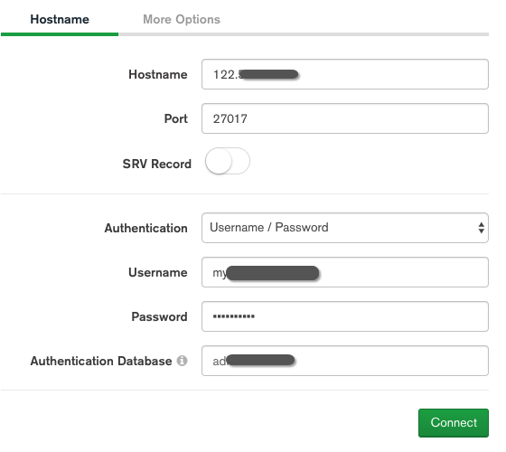

## 启动/退出 :MongoDB

###  启动MongoDB

```shell
# 在mongodb的bin目录下启动命令
./mongod -f ./mongodb.conf

# 在windows下的启动命令	
net start mongoDB	

# 查看是否启动成功
ps -ef|grep mongodb
```

### 退出MongoDB

```shell
use admin;
db.shutdownServer();
```

## 数据库的基本操作

- https://docs.mongodb.com/manual/
- https://www.mongodb.org.cn/tutorial/

```shell
1.连接MongoDB服务器
mongo
# 看到 connecting to : mongdb://ip:27017/?compressors=disable.... 即表示连接到数据库服务器
# 完整登录指令
mongo --port 27017 -u "myAdmin" -p "4GxWkhFGVIlhnPw4kj6xAOO&18h6s" --authenticationDatabase "admin"
# 验证信息,第二步返回1 验证成功
use admin
db.auth("myAdmin","4GxWkhFGVIlhnPw4kj6xAOO&18h6s")
db.auth("tr1Xxn^94hUqJPy%WUG&Oj","WV&f9jyZ^KonusBSrMuyhL")

2.查看数据库
show dbs

3. 切换/创建数据库
use 数据库名称

4.查看数据库中有哪些集合
show collections

5.创建集合
db.createCollection('集合名称');

6.插入数据
db..insert({JSON 对象});
6.1 插入⼀条数据
db.集合名称.save({name:'苹果',price:5})
6.2 插入一条数据 insertOne(json数据)
db.fruits.insertOne({ name: "apple" })
6.3 批量插入数据
db.fruits.insertMany([
  { name: "apple" }, { name: "pear" }, { name: "orange" }
])

7.查询数据
db.集合名称.find();
# 显示查询数据

8.删除集合
db.集合名称.drop()
# 返回 true 

9.删除数据库
db.dropDatabase()
#在哪个数据库中就会删除哪个数据库
#返回 { "dropped": "数据名", "ok": 1} 表示删除成功

10. 得到当前db的所有聚集集合 
db.getCollectionNames()

`要启用免费监视，请运行以下命令：`
db.enableFreeMonitoring（）

`要永久禁用此提醒，请运行以下命令：`
db.disableFreeMonitoring（）
```


## 数据库导出

- 在 shell 环境输入
- -u 数据库用户名
- -p 用户对应的密码
- -p 访问数据库路径
- -d 数据库名
- -c 集合名
- -o 下载导出到什么位置, json 格式

```shell
#数据库集合导出 
mongoexport -u blogAdmin -p sl19870719 -h 127.0.0.1:27017 -d myBlog -c user -o /web/db/user.json

```


## 可视化工具连接

1. 点击: Fill in connection fields individually `(分别填写连接字段)`
2. 选 **`Authentication`** 中的 `Username/Password`
3. 填写内容: 
   1. ip 地址
   2. 账号
   3. 密码
4. 点击 CONNECT





## 