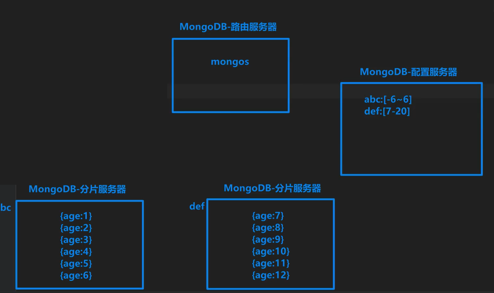

## 什么是复制集?

- '多台''保存了相同数据'的MongoDB服务器组成
- 复制集解决的问题
  - 高可用性-服务器宕机不会影响我们继续使用
  - 数据安全性-服务器损坏数据不会丢失
- 复制集不能解决的问题
  - 服务器容量的问题
  - 我们都知道一台服务器的容量是有上限的
    所以我们只能通过增加服务器的台数来提升容量
  - 复制集虽然是由多台电脑组成的, 但是由于多台电脑保存的数据都是一样的
    所以在复制集中虽然电脑增多了, 但是容量并没有增加
    所以复制集是不能解决服务器容量问题的

## MongoDB中如何增加服务器容量?

- 通过'分片服务器'来实现,

### 1. 什么是分片服务器?

- 分片就是将数据库集合中的数据拆分成多份, 分布式的保存到多台电脑上
+ 这样**不同的电脑**保存不**同的数据**, 就大大的提升了服务器的容量

### 2. 分片服务器注意点

- 并不是数据库所有的集合都需要使用分片, 对于那些**不使用分片的集合**会统一保存到**主分**片中
+ 默认每个数据库都有一个**主分片**, 保存那些不需要分片的集合数据
- 在创建数据库的时候, 系统会自动选择存储内容最少的分片作为主分片

### 3. 分片服务器集群结构

1. 配置服务器:
   1. 用于保存分片服务器存储数据的范围, 分配数据存储到那一台分片服务器.
   2. 通过范围,将来就知道,如何查询和存储数据
2. 分片服务器: 用于保存集合中的一部分数据.
   1. 专门用于存储不同数据的服务器
3. mongos路由(路由服务器): 
   1. 用于分发用户请求的服务器
   2. **路由服务器的分发流程**
      1. 用户将请求发送到路由服务器
      2. 路由服务器去配置服务器查询数据段(数据范围)
      3. 根据查询的结果到对应的分片服务器上做处理
      4. 拿到处理结果,将结果返回给用户

### 3. 分片集群执行流程

1. 用户发送请求到	->  'mongos路由' 
2.  'mongos路由'去' -> 配置服务器'查询数据在哪个分片服务器
3. 'mongos路由'根据'配置服务器'返回的结果到对应的'分片服务器'操作数据
4. '分片服务器'将操作结果返回给'mongos路由', 'mongos路由'将最终结果返回给用户




## 如何将数据存储到不同的分片服务器上的?

- 通过分片片键

### 1. 什么是分片片键?

1. 可以将文档的一个或多个字设置成分片片键

2. 设置完分片片键后, MongoDB会自动对字段可能的取值进行划分, 划分出一个个的数据段

3. 划分完数据段之后,  MongoDB会自动决定哪些分片服务器保存哪些数据段对应的数据

   

例如: {name:'lnj', age:33}

- 自动划分范围 

1. ```js
       age:min    20     40     60     80    age:max
          |-------|------|------|------|------|
    分片服务器1      分片服务器2       分片服务器3
   |-----------|    |-----------|     |-----------|
   |   min-20  |    |   80-max  |     |   40-60   |
   |   20-40   |    |   60-80   |     |           |
   |-----------|    |-----------|     |-----------|
   ```

   

**注意点:**

1. 片键可以是一个字段也可以是多个字段
2. 只有索引字段才能设置为片键
3. 分片服务器保存哪些数据段的值是随机的, 并不是连续的
4. 数据段的划分可以使用片键的取值, 也可以使用片键取值的哈希值

### 3. 如何选择片键

1. 应该选择取值范围更广的字段作为片键

   - 使用分片的目的是为了将数据存储到不同的服务器上, 所以在选择片键的时候. 应该选择取值范围更广的字段作为片键. 因为如果取值范围太小, 那么划分出来的数据段就太少, 那么分配到不同服务器的概率就越小

   例如:

   ​	 `取值如果只有true或false,` 那么就只能划分出两个数据段, 那么也就最多只能保存到两台服务器上

2. 应该选择取值分配更平衡字段作为片键

   - 因为如果取值范围不平衡, 就会导致某一个数据段的数据太多, 某一台分片服务器压力太大

   例如: 

   ​	将age作为片键, 但是我们的用户90%都集中中20~30岁,
   ​      那么就会导致保存20~30数据段的分片服务器存储数据过多压力过大

3. 不应该选择单向增加或者减少的字段作为片键

   - 因为如果取值是单向增加或者减少的, 那么就会出现可能出现的最小值数据段或者最大值数据段保存的数据过多
   - 对应的分片服务器压力过大

### 4.片键选择技巧

1. 如果片键字段取值范围不够广, 那么我们可以使用复合片键
2. 如果片键字段的取值不够平衡, 那么我们可以使用复合片键
3. 如果片键字段的取值是单向增加或减少的, 那么我们可以使用片键字段取值的哈希值

### 5. 片键注意点

- 片键一旦选择就不能更改, 所以在前期选择片键时一定要多动脑


## 数据段分裂

属于自动优化

1. 分片的主要目的就是将数据分配到不同的服务器中保存,提升服务器的容量, 让数据更加的均衡, 更有效的降低服务器的压力

2. 但是随着时间推移, 某些数据段中保存的数据会越来越多,所以为了保证个分片均衡, 当某个数据段数据过多或体积过大的时候,

3. 系统就会自动在下一次操作这个数据段时(新增/更新), 将一个大的数据段分裂成多个小的数据段

   

## 分片平衡

属于自动优化

1. 除了当某个数据段数据过多或体积过大的时候会自动对数据段进行分裂以外
2. 当各分片服务器上保存的数据段之间数量相差较大时, 还会自动触发分片服务器数据段迁移
3. 在MongoDB中后台会自动运行一个'集群平衡器'来负责监视分片的平衡和调整分片的平衡


## 分片查询注意事项

- 用户的请求会发送给mongos路由服务器,路由服务器会根据查询条件去配置服务器查询对应的数据段和属于哪个分片服务器

1. 如果用户查询的条件是分片片键字段
   1. 那么路由服务器会返回保存在那一台分片服务器上, 路由服务器就会去对应的分片服务器获取数据,并将取到的数据返回给用户. **速度是很快的**
2. 如果用户查询的条件不是分片片键字段,
   1. 那么配置服务器无法告知路由服务器数据保存在哪一个分片服务器上, 路由服务器会把请求发送到所有的分片服务器上, 然后再将查询到的数据汇总后返回给用户. **速度会慢一些**


