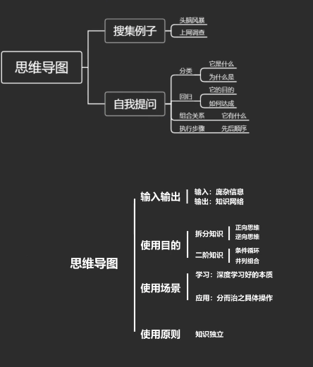
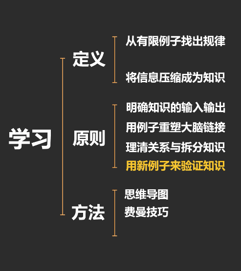
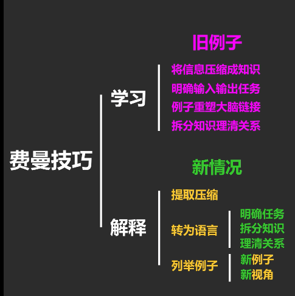
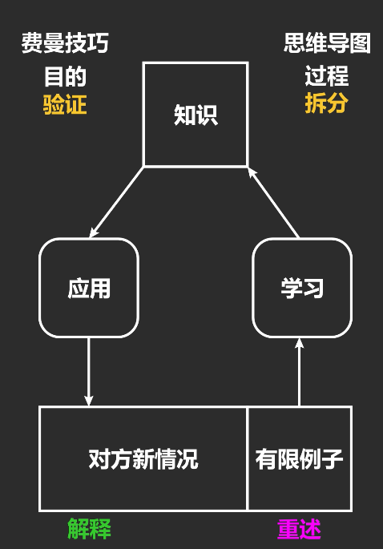

## 学习方法

好奇心-> 引发求知欲-> 满足欲望是快乐的-> 找出好奇心

## 记忆

- 容量有限
- 难以集齐所有可能性

学习

- 找出知识
- 压缩信息

学习的第一步:

找出什么是问题,什么是答案. 没有这两个问题的答案,就仅仅是记住了知识的描述.

最后通过例子理清楚问题和答案的关系.

先尽可能的搜集更多的例子,体会问题和答案之间的关系.当真正学会的时候,这些例子的被压缩成知识

## 学习方式

1. 运动类
2. 思考类

区别在于是否依靠意识,因为意识是后进化出来的, 用来推断,但是速度慢

## 学不会的原因

1. 错误输入输出
2. 错误的学习方式

例如: 

- 用读书的方式学习游泳和做饭
- 不通过例子仅仅记忆知识.

语言的输入从来不是一个单词,而是一个句子. 想要把我句子中单词真正的含义,需要体会大量不同的例句

## 常识

- 运动类知识可以同时进行
  - 走路,聊天.
- 意识在一个时刻只能专注一个思考类问题

## 线性思考的方法

可以解决指数级答案才能解决的问题

思维导图

1. 列关键词
2. 它是什么
3. 它的目的
4. 拆分知识

学习原则

1. 明确任务输入输出
2. 将信息压缩成知识
3. 例子重塑大脑连接
4. 二阶知识拆分知识
   1. 二阶知识就是知识和知识之间的知识
   2. 一阶知识是问题和答案之间的规律

## 费曼学习技巧

1. 学习
2. 解释

