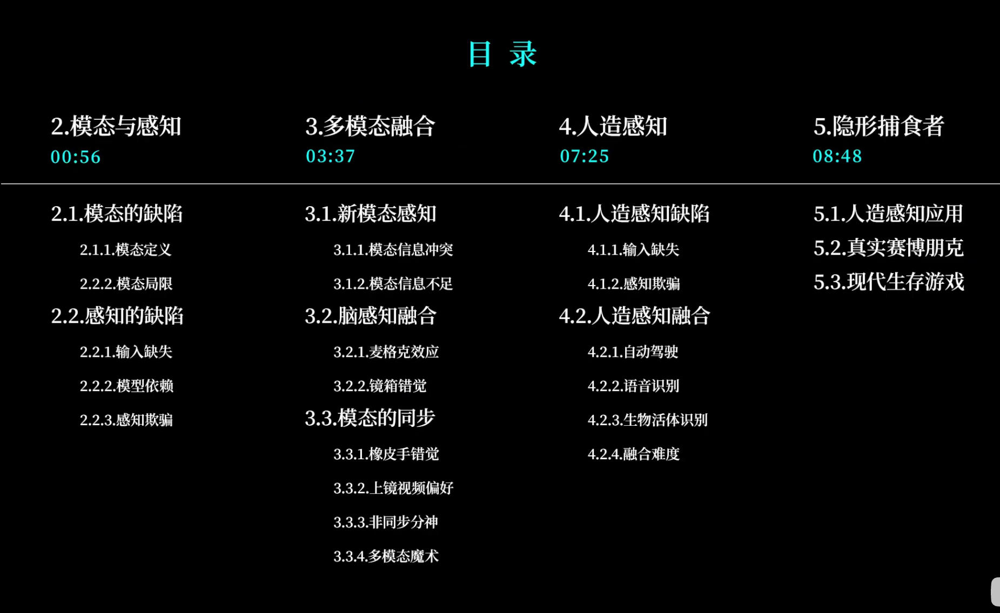
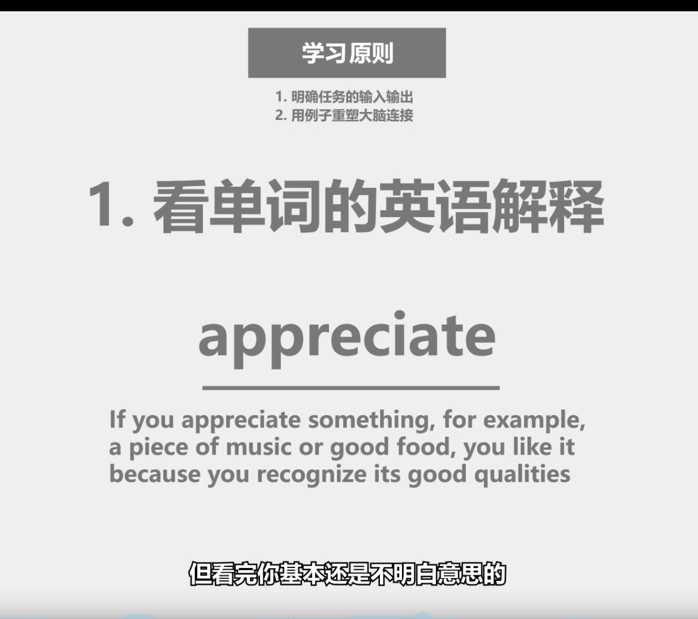

## 运动类知识

无法通过理解掌握,需要大量输入->输出 且没有中间输出

举例

## 英语

1. 听
2. 说
3. 读
4. 写

四个能力,首先决定加强哪一个, 然后通过很多不同的例子来重塑大脑连接

- 每个例子是输入与输出的配对	 

## 学习方法

1. 明确任务的输入输出
2. 用例子重塑大脑连接

来来来 课代表来哪
学习原则：
    1.明确任务的输入输出。
    2.用例子重塑大脑连接
学习步骤：
    1：看单词的英文解释
    2：多看例句体会意思
    3：选择常用的简单句
    4：看句子--想场景
        读(看)
        重复两三次
    5：表达欲--打出字
        写
    6：听句子--想场景
        听
    7：表达欲--说句子
        说
    8：该单词--再重复
PS：重点--
    1.不要依靠意识
    2.以句子为单位
    3.多例子学习
    4.输出始终要一致

## 做决策的时候需要思考,但是在学习过程不需要依靠意识. 因为运动类知识依靠体验的来完成学习 		

需要确定正确的输入和输出,靠大量的例子来重塑大脑连接即可