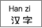

**根元素**    <html>      **脚本**     <script>脚本     <noscript>代替脚本失效是显示         <template> 未知

 

## **文档元数据**

   <head>  文档头：用来设置网页相关元数据  

   <title>   网页标题                  <base>所有相对链接的基准URL       <link> 外联其他资源到本网页内

     <meta>   设置字符编码/网页关键字词            

 

## 容器类标签

>  **->均是div的语义化形式的标签**          <body> 文档主题     

<section> 内容为标题和文章  <nav>   导航标签    <article> 定义内容与文档不同的容器    <aside>  侧边栏标签

​    <header> 头部标签        <footer> 尾部标签     <address>写文档作者/所有者的联系信息。              

<main>  指定文档的重要内容且是网页唯一的标签，只能在body内嵌套

   <hgroup> 分组标签被用来对 h1-h6标题元素进行分组

## **功能/样式标签** ： 

<a>      超链接            
横线标签               换行        下标文本       上标文本

<mark> 标记文字自带浅黄色背景     <dialog> 标签定义一个对话框、确认框或窗口

 

## **文字类容器标签**

> span的语义化形式的标签**

<h1>-<h6>网页标题         
 段落               <pre>预格式化的文本           <blockquote>引用的文字

<ul>无序列表>li             <ol> 有序列表>li           <li> 列表内容器标签          

<dl>自定义列表>dt+dd        <dt> 条目标签            <dd> 列表容器标签，描述条目

 

## **文字形式**

 无语义文字容器    <ruby>  汉<rt>han</rt> 字<rt>han</rt> </ruby>              rp: 标识（）等隐藏信息

<em>  斜体<i>         <strong> 重要<b>         <small>  加细         <del>删除线<s>      <ins>   下划线<u>

<cite>  标记作品名       <q>    引号标记文本     <dfn>   定义项目    <var>定义变量        <kbd>   键盘文本

<code> 电脑代码                <samp>   计算机样本           <textarea>文本框标签，可拖拉大小

<abbr> 标记缩写词title属性中写完整词               <time>  通过d atetime属性备注时间方便机器理解，完成准时提醒

<bdi>  标记设置文本方向和父元素不同               <bdo>   属性设定dir文本方向     <wbr>告诉计算机宽度不够，此处分行

 

## **表格**

<table>        定义表格         <tr>               定义：行                <td>        定义：列               <th>       定义：表头             

<caption>   定义表格标题  <colgroup>   设置表格内的样式搭配col标签               <col>   搭配别的样式

<thead>    表头        <tbody>     表主体          <tfoot>  表尾        

<tbody> 元素应该与 <thead> and <tfoot> 元素结合起来使用，用来规定表格的各个部分（主体、表头、页脚）

 

## **表单**

  <form>定义表单           <input>     控件type 属性的值决定功能  <button> 按钮控件可设置内容     

<label>文本可以绑定焦点控件的id

<fieldset>（表单内的相关元素分组/    <legend>    分内容显示在边框上）

<select>(可选项控件             <optgroup>   分组可选项控件           <option> 可选项控件)          

<datalist>预置下拉列表选项，完成快速填写 用input的list属性绑定id值   

<textarea>多行的文本输入控件      <keygen>

<output>标签作为计算结果输出显示   <progress>   任务进度条              <meter> 进度条,仅用于已知最大和最小值的度量

 

## **交互元素**  

<datails>与 
 标签配合,  
内是标题，下面是隐藏内容到</datails>为止         

<menuitem>     <menu>

 

## **嵌入内容**

​          图片标签      <map>  图像中映射链接标签           <area>  在map内设置映射的具体区域

<video> 视频标签        <audio>音频标签            <source> 音频和视频标签内设置资源使用      <track>    为音频和视频包含字幕文件

<iframe>用src=插入一个网页到该标签位置          <embed> 容器嵌入外部应用或者互动程序       <math>   数学标记语言

<canvas>图形容器，通过脚本JS来绘制       <figure> 引入独立资源内容(图表/片/代码等)  <figcaption>为figure定义标题

<object>原意包含对象,各种资源文件         <param> 在object元素补充设置         <svg>