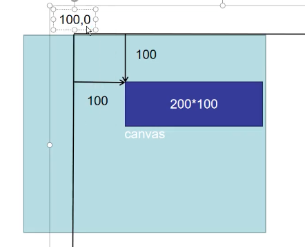

## 形变

### 平移

> 平移是平移了整个坐标系,不是移动哪个矩形的 x 值

~~~html

<!DOCTYPE html>
<html lang="en">
<head>
  <meta charset="UTF-8">
  <title>24-Canvas形变</title>
  
</head>
<body>
<canvas width="500" height="400"></canvas>

</body>
</html> 
~~~

