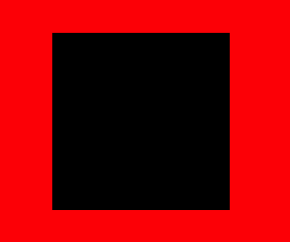
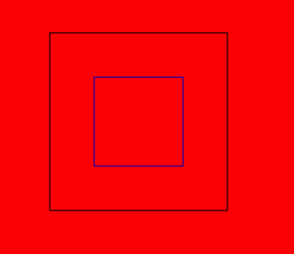
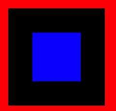
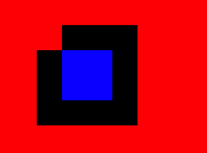
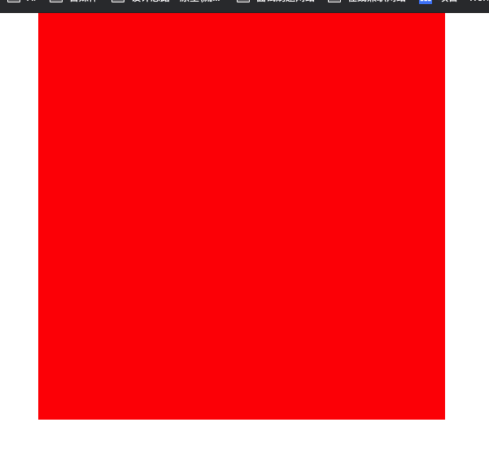

## 使用函数绘制矩形

1. rect 矩形路径
2. strokeRect 空心矩形
3. fillRect   填充矩形
4. clearRect 矩形清除

### 方法 1

> rect(x, y, width, height)
>
> 

~~~HTML
<body>
<canvas width="500" height="500"></canvas>

</body>
~~~

### 方法 2

> 绘制空心矩形
>
> strokeRect(x, y, width, height)
>
> 相当于 2 句话 1.开启新的路径,2. 连接点
>
> 

~~~HTML
<body>
<canvas width="500" height="500"></canvas>

</body>
~~~

### 方法 3

> 绘制一个填充矩形
>
> 

~~~HTML
<body>
<canvas width="500" height="500"></canvas>

</body>
~~~

#### 方法4

> 指定区域不可以有矩形
>
> 

~~~~HTML
<body>
  <canvas width="500" height="500"></canvas>
  
</body>
~~~~

### 方法 5

> 删除指定矩形
>
> 

~~~HTML

<body>
  <canvas width="500" height="500"></canvas>
  
</body>
~~~

