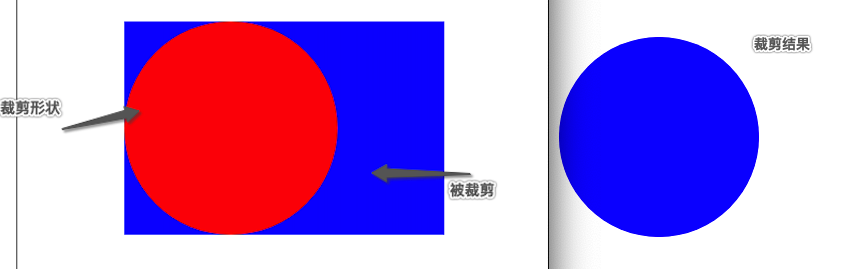

## 裁剪 clipPath

- 只有路径范围内的内容会被显示, 路径范围外的内容不会被显示

~~~HTML
<!DOCTYPE html>
<html lang="en">
<head>
    <meta charset="UTF-8">
    <title>15-SVG裁剪和蒙版</title>
    
</head>
<body>
<svg width="500" height="500">
    <!-- 裁剪形状制作 -->
    <clipPath id="myClip">
        <circle cx="200" cy="200" r="100" fill="red"></circle>
    </clipPath>
    <!-- 从 rect 的图形中裁剪   -->
    <rect x="100" y="100" width="300" height="200" fill="blue" clip-path="url(#myClip)"></rect>
</svg>
</body>
</html>
~~~

## mask

- 裁切路径是可见与不可见的突变
- 蒙版则是可见与不可见的渐变

注意点: 在指定裁剪和蒙版的时候需要通过url(#id)来指定

~~~html
<!DOCTYPE html>
<html lang="en">
<head>
  <meta charset="UTF-8">
  <title>15-SVG裁剪和蒙版</title>
  
</head>
<body>
<svg width="500" height="500">
  <!-- 本来要显示的圆形 -->
  <mask id="myMask">
      <circle cx="200" cy="200" r="100" fill="rgba(255, 0, 0, 0.5)"></circle>
  </mask>
	<!-- 添加蒙版,并设置蒙版颜色蓝色 ,此示例效果是紫色是因为 红色+蓝色=紫色 -->
  <rect x="100" y="100" width="300" height="200" fill="blue" mask="url(#myMask)"></rect>
</svg>
</body>
</html>
~~~

