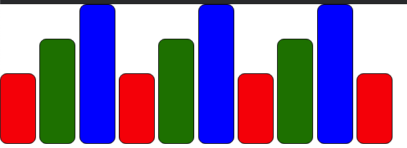

## GPAP 配置

> 通过配置可以更多丰富动画效果

## 配置参数书写位置

> 在第三个参数中书写配置

~~~html
<script>
  new TweenMax(".box", 3, {
      // 设置动画开始之前的延迟时间
      // delay: 2,
      // 设置动画初识值
      startAt: {
          x: 100
      },
      // 设置动画结束值
      css: {
          x: 500,
      },
      // 设置动画重复执行的次数
      // 无限重复 -1
      repeat: 2,
      // 设置动画重复执行的往返动画
      yoyo: true,
      // 设置重复动画开始之前的延迟时间
      repeatDelay: 3,
      // 设置动画执行的节奏
			// 开启动画,在结束位置使用弹簧效果
			ease: Bounce.easeOut,
			// 在重复动画时,不要在开始时使用弹簧效果
			yoyoEase: Bounce.easeOut
  });
</script>
~~~


## 延迟时间

~~~js
//设置动画开始之前的
delay: 2,
~~~


## 设置动画初识值

~~~js
startAt: {
  x: 100
},
~~~


## 设置动画结束值

~~~js
css: {
  x: 500,
},
~~~


## 设置动画重复执行的次数

~~~js
// 无限重复 -1
repeat: 2,
~~~


## 设置动画重复执行的往返动画

~~~js
yoyo: true,
~~~


## 设置重复动画开始之前的延迟时间

~~~js
repeatDelay: 3,
~~~


## 设置动画执行的节奏

~~~js
// 开启动画,在结束位置使用弹簧效果
ease: Bounce.easeOut,
// 在重复动画时,不要在开始时使用弹簧效果
yoyoEase: Bounce.easeOut
~~~


## 循环动画



```HTML
<!DOCTYPE html>
<html lang="en">
<head>
    <meta charset="UTF-8">
    <title>04-GSAP循环动画</title>
    <style>
        *{
            margin: 0;
            padding: 0;
        }
        div{
            display: inline-block;
            width: 50px;
            height: 50px;
            background: #ccc;
            border: 1px solid #000;
            border-radius: 10px;
        }
    </style>
    <script src="js/TweenMax.js"></script>
</head>
<body>
<div class="box"></div>
<div class="box"></div>
<div class="box"></div>
<div class="box"></div>
<div class="box"></div>
<div class="box"></div>
<div class="box"></div>
<div class="box"></div>
<div class="box"></div>
<div class="box"></div>
<script>
    let oDivs = document.querySelectorAll(".box");
    TweenMax.staggerTo(oDivs, 3, {
        cycle: {
            height: [100, 150, 200],
            backgroundColor: ["red", "green", "blue"]
        }
    }, 3);
</script>
</body>
</html>
```

