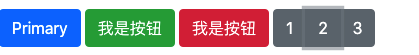

## 常用组件

> 组件就是对常用功能的封装

## 什么是role

> - role属性用于增强语义性, 当现有的HTML标签不能充分表达语义性的时候，就可以借助role来说明
> - 比如用div做button，那么设置div 的 role=“button”，辅助工具就可以认出这实际上是个button

~~~html
<!-- 顶部窗口 -->
<div class="alert alert-success" role="alert">
  A simple primary alert—check it out!
</div>

<!-- 顶部广告窗口
  alert-dismissible: 将来可以关闭
  fade: 淡出
  show: 显示
  role: 语义化的弹窗
-->
<div class="alert alert-warning alert-dismissible fade show" role="alert">
  
  <!--
	close 关闭按钮
  data-dismiss="alert" 告诉bt需要关闭谁
  -->
  <button type="button" class="close" data-dismiss="alert">
      <span>&times;</span>
  </button>
</div>
~~~


## 按钮



https://code.z01.com/bootstrap/components/buttons.html

https://code.z01.com/bootstrap/components/button-group.html

~~~html
<!-- 按钮组件 -->
<button type="button" class="btn btn-primary">Primary</button>
<input type="button" value="我是按钮" class="btn btn-success">
<a href="#" class="btn btn-danger">我是按钮</a>


<div class="btn-group">
    <button type="button" class="btn btn-secondary">1</button>
    <button type="button" class="btn btn-secondary">2</button>
    <button type="button" class="btn btn-secondary">3</button>
</div>
~~~


## 卡片组件

> 一个小整体即可用卡片组件


```html
<div class="card" style="width: 18rem;">
  <!-- card-img-top 左上角和右上角有圆角 -->
  
  <!-- 卡片正文部分 -->
  <div class="card-body">
    <h5 class="card-title">Card title</h5>
    <p class="card-text">Some quick example text to build on the card title and make up the bulk of the card's content.</p>
  </div>
</div>
```


## 轮播图组件

> 1. 自适应


```html

<!--
1.class="carousel slide" 创建一个轮播图组件
2.data-ride="carousel" 自动轮播
-->
<div id="carouselExampleIndicators" class="carousel slide" data-ride="carousel">
<!--
1.class="carousel-indicators" 创建底部指示器
2.data-target="#carouselExampleIndicators" 告诉bootstrap当前的索引属于哪一个轮播图,即顶部 id 属性值
3.data-slide-to="0" 指定当前指示器的索引
4.class="active" 设置默认选中的指示器索引
-->
<ol class="carousel-indicators">
  <li data-target="#carouselExampleIndicators" data-slide-to="0" class="active"></li>
  <li data-target="#carouselExampleIndicators" data-slide-to="1"></li>
  <li data-target="#carouselExampleIndicators" data-slide-to="2"></li>
</ol>
<!--
1.class="carousel-inner" 创建轮播图的内容部分
2.class="carousel-item" 指定轮播图的每一页
3.class= "active" 是指定默认显示页
-->
<div class="carousel-inner">
  <div class="carousel-item active">
    
  </div>
  <div class="carousel-item">
    
  </div>
  <div class="carousel-item">
    
  </div>
</div>
<!--
1.class="carousel-control-prev" 创建上一页的控制按钮
2.href="#carouselExampleIndicators" 指定控制按钮可用控制哪一个轮播图,即顶部 id 属性值
-->
<a class="carousel-control-prev" href="#carouselExampleIndicators" role="button" data-slide="prev">
  <span class="carousel-control-prev-icon" aria-hidden="true"></span>
</a>
<a class="carousel-control-next" href="#carouselExampleIndicators" role="button" data-slide="next">
  <span class="carousel-control-next-icon" aria-hidden="true"></span>
</a>
</div>

```


## 折叠面板组件


~~~html

<!--
1.data-toggle="collapse" 告诉bootstrap需要切换的是折叠面板
2.href="#collapseExample" 告诉bootstrap需要切换的是哪一个折叠面板
-->
<a class="btn btn-primary" data-toggle="collapse" href="#collapseExample" role="button">
    我是按钮
</a>
<!--
1.class="collapse" 创建一个折叠面板
注意点: 折叠面板默认情况下是不会显示的
-->
<div class="collapse bg-danger" id="collapseExample">
    <p>我是段落1</p>
    <p>我是段落2</p>
    <p>我是段落3</p>
    <p>我是段落4</p>
    <p>我是段落5</p>
</div>
~~~


## 下拉菜单

```html

<!--
1.class="dropdown" 创建一个下拉菜单的容器
-->
<div class="dropdown">
    <!--
    1.dropdown-toggle: 指定菜单按钮的小箭头
    2.data-toggle="dropdown": 告诉bootstrap需要切换的是下拉菜单
    -->
    <button class="btn btn-secondary dropdown-toggle"  data-toggle="dropdown">
        我是按钮
    </button>
    <!--
    1.class="dropdown-menu": 创建一个弹出的下拉菜单
    2.class="dropdown-item": 指定菜单项
    -->
    <div class="dropdown-menu">
        <a class="dropdown-item" href="#">Action</a>
        <a class="dropdown-item" href="#">Another action</a>
        <a class="dropdown-item" href="#">Something else here</a>
    </div>
</div>
```


## 模态弹窗

> 有蒙版的弹窗

~~~html
<!--
1.data-toggle="modal": 告诉bootstrap需要切换的是模态弹窗
2.data-target="#exampleModal": 告诉bootstrap需要切换的是哪一个模态弹窗
-->
<button class="btn btn-primary" data-toggle="modal" data-target="#exampleModal">
    我是按钮
</button>

<!--
class="modal fade": 创建模态弹窗的容器
-->
<div class="modal fade" id="exampleModal" tabindex="-1" role="dialog">
    <!--
    1.class="modal-dialog": 创建真正弹出的内容
    -->
    <div class="modal-dialog" role="document">
        <div class="bg-danger">
            <p>我是段落1</p>
            <p>我是段落2</p>
            <p>我是段落3</p>
            <p>我是段落4</p>
            <p>我是段落5</p>
        </div>
    </div>
</div>
~~~


## 提示气泡组件


```html

<div style="margin: 200px">
    <!--
    1.data-toggle="tooltip": 告诉bootstrap需要切换的是提示气泡
    2.data-placement="top": 告诉bootstrap提示气泡出现的位置
    3.title="Tooltip on top": 告诉bootstrap提示气泡中提示的内容是什么
    -->
    <!--
    <button class="btn btn-secondary" data-toggle="tooltip" data-placement="left" title="内容是什么">
        我是按钮
    </button>
    -->

    <!--
    1.data-container="body": 当你在一个父元素上有一些样式与提示框产生样式干扰，你可以指定一个自定义的container容器，这样提示框的HTML将出现在这个元素内部了。
    2.data-toggle="popover": 告诉bootstrap需要切换的是提示气泡
    3.data-placement="top": 告诉bootstrap提示气泡出现的位置
    4.data-content="": 告诉bootstrap提示气泡中提示的内容是什么
    -->
    <button class="btn btn-secondary" data-container="body" data-toggle="popover" data-placement="right" data-content="我是内容我是内容">
        我是按钮
    </button>
</div>
```


## 响应式的导航栏


~~~html

<!--
1.class="navbar": 告诉Bootstrap需要创建一个响应式的导航栏
2.class="navbar-expand-lg": 告诉Bootstrap在哪一种屏幕尺寸上需要展示完整的导航栏
3.class="navbar-light bg-light": 设置导航栏的主题样式
-->
<nav class="navbar navbar-expand-xl navbar-light bg-light">
  <!--
  1.class="navbar-brand": 指定导航栏中公司的品牌信息(公司名称/LOGO)
  -->
  <a class="navbar-brand" href="#">知播渔</a>
  <!--
  1.class="navbar-toggler": 创建一个移动端的菜单按钮
  2.data-toggle="collapse": 告诉bootstrap需要切换的是折叠面板
  3.data-target="#navbarSupportedContent": 告诉bootstrap需要切换的是哪一个折叠面板
  4.class="navbar-toggler-icon": 设置按钮的字体图标
  -->
  <button class="navbar-toggler"  data-toggle="collapse" data-target="#navbarSupportedContent">
    <span class="navbar-toggler-icon"></span>
  </button>
  <!--
  1.class="collapse": 创建一个折叠面板
  注意点: 折叠面板默认情况下是不会显示的
  2.class="navbar-collapse":用于通过父断点进行分组和隐藏导航列内容
  -->
  <div class="collapse navbar-collapse" id="navbarSupportedContent">
      <!--
      1. class="navbar-nav": 创建导航栏的菜单
      2. class="nav-item": 创建导航来的菜单项
      -->
    <ul class="navbar-nav mr-auto">
      <li class="nav-item">
        <a class="nav-link" href="#">Home <span class="sr-only">(current)</span></a>
      </li>
      <li class="nav-item active">
        <a class="nav-link" href="#">Link</a>
      </li>
      <li class="nav-item dropdown">
        <a class="nav-link dropdown-toggle" href="#" id="navbarDropdown" role="button" data-toggle="dropdown" aria-haspopup="true" aria-expanded="false">
            Dropdown
        </a>
        <div class="dropdown-menu" aria-labelledby="navbarDropdown">
          <a class="dropdown-item" href="#">Action</a>
          <a class="dropdown-item" href="#">Another action</a>
          <div class="dropdown-divider"></div>
          <a class="dropdown-item" href="#">Something else here</a>
        </div>
      </li>
      <li class="nav-item">
        <a class="nav-link disabled" href="#">Disabled</a>
      </li>
    </ul>
  </div>
</nav>
~~~


## 适配残障人士的可选项


### 什么是aria-xxx

```html
aria全称: Accessible Rich Internet Applications
这一套协定是w3和apple为了"残疾人士"无障碍使用网站的
```


### 什么是aria-hidden

为了避免屏幕识读设备抓取非故意的和可能产生混淆的输出内容

（尤其是当图标纯粹作为装饰用途时），我们为这些图标设置了 aria-hidden=“true” 属性

~~~html


~~~


