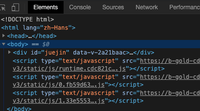

## 0. 插件的5类JS：

>  `injected script`、`content-script`、`popup js`、`background js`和`devtools js`，

### 1. 权限对比

| JS种类          | 可访问的API                                    | DOM访问情况  | JS访问情况 | 直接跨域 |
| --------------- | ---------------------------------------------- | ------------ | ---------- | -------- |
| injected script | 和普通JS无任何差别，不能访问任何扩展API        | 可以访问     | 可以访问   | 不可以   |
| content script  | 只能访问 extension、runtime等部分API           | 可以访问     | 不可以     | 不可以   |
| popup js        | 可访问绝大部分API，除了devtools系列            | 不可直接访问 | 不可以     | 可以     |
| background js   | 可访问绝大部分API，除了devtools系列            | 不可直接访问 | 不可以     | 可以     |
| devtools js     | 只能访问 devtools、extension、runtime等部分API | 可以         | 可以       | 不可以   |

### 调试方式

## 调试方式对比

| JS类型          | 调试方式                 | 图片说明                                                     |
| --------------- | ------------------------ | ------------------------------------------------------------ |
| injected script | 直接普通的F12即可        |  |
| content-script  | 打开Console,如图切换     |  |
| popup-js        | popup页面右键审查元素    |  |
| background      | 插件管理页点击背景页即可 |  |
| devtools-js     | 暂未找到有效方法         | -                                                            |


##   1. content_scripts

##### 作用

> 1. 配置文件manifest.js中的content_scripts参数: 就是插件向页面注入脚本的一种形式,借助content_scripts,可以实现向指定页面注入JS和CSS(动态注入) 应用场景比如: 广告屏蔽,页面css订制,等等.
> 2. content-script可以注入内容到页面上,但是如果页面添加一个按钮,却不能调用content-script中的方法.

~~~js
 "content_scripts": [{
    "matches": ["<all_urls>"], 
    "js": ["./main/contentScript.js"],
    "run_at": "document_start"
  }]
~~~

注意:没有主动指定`run_at`为**`document_start`**（默认为`document_idle`），下面这种代码是不会生效的：

```javascript
document.addEventListener('DOMContentLoaded', function()
{
	console.log('我不会被执行了！');
});
```

##### 需知

 1.  content-scripts和原始页面共享DOM，但是不共享JS

 2.  调用其它API，和background.js通信来完成调用

 3.  如要访问页面JS（例如某个JS变量），只能通过injected js来实现

 4.  content-scripts不能访问绝大部分chrome.xxx.api，除了下面这4种：

     ~~~js
     chrome.extension(getURL , inIncognitoContext , lastError , onRequest , sendRequest)
     chrome.i18n
     chrome.runtime(connect , getManifest , getURL , id , onConnect , onMessage , sendMessage)
     chrome.storage
     ~~~

     

## 2. background

> ​	生命周期 :随浏览器打开而打开,随浏览器关闭而关闭 : 	把需要一直运行的内容,放在此处.
>
> ​	权限: 除了devtools(调试工具) 可以调用几乎全部的chrome扩展API,且无限制跨域.
>
> ~~~js
> // 	经过测试，其实不止是background，所有的直接通过chrome-extension://id/xx.html这种方式打开的网页都可以无限制跨域。
> ~~~
>
> ```
> 需要特别说明的是，虽然你可以通过chrome-extension://xxx/background.html直接打开后台页，但是你打开的后台页和真正一直在后台运行的那个页面不是同一个，换句话说，你可以打开无数个background.html，但是真正在后台常驻的只有一个，而且这个你永远看不到它的界面，只能调试它的代码。
> ```
>
> 

#### 使用方法

~~~js
1. 通过配置文件 指定后台js由哪个文件担当,然后在对应的文件里写代码即可
 "background": {
    "scripts": ["./main/background/background.js"],
    "persistent": false
  }
~~~

#### 小后台event-pages

~~~js
/这里顺带介绍一下event-pages，它是一个什么东西呢？鉴于background生命周期太长，长时间挂载后台可能会影响性能，所以Google又弄一个event-pages，在配置文件上，它与background的唯一区别就是多了一个persistent参数：
{
	"background":
	{
		"scripts": ["event-page.js"],
		"persistent": false
	},
}
它的生命周期是：在被需要时加载，在空闲时被关闭，什么叫被需要时呢？比如第一次安装、插件更新、有content-script向它发送消息，等等。
除了配置文件的变化，代码上也有一些细微变化，个人这个简单了解一下就行了，一般情况下background也不会很消耗性能的。
~~~


## 3. popup(右上角点击弹出页面)

> `popup`用来做临时交互,点击右上角的图标打开,失去焦点关闭,生命周期短。
>
> > ​	在权限上，它和background非常类似，它们之间最大的不同是生命周期的不同，popup中可以直接通过`chrome.extension.getBackgroundPage()`获取background的window对象。

#### 使用方法

~~~js
配置方式：
{
	"browser_action":
	{
		"default_icon": "img/icon.png",
		// 图标悬停时的标题，可选
		"default_title": "这是一个示例Chrome插件",
		"default_popup": "popup.html"
	}
}
~~~


## 4 . injected-script(脚本注入)

> 1. DOM操作的方式向页面注入内容
> 2. content-script可以注入内容到页面上,但是如果页面添加一个按钮,却不能调用content-script中的方法.

#### [使用 :更多](https://www.cnblogs.com/liuxianan/p/chrome-plugin-develop.html#injected-script)

~~~js
# 先声明
	// 普通页面能够直接访问的插件资源列表，如果不设置是无法直接访问的
	"web_accessible_resources": ["./js/inject.js"],
~~~

[更多说明(url:https://www.cnblogs.com/liuxianan/p/chrome-plugin-develop.html#injected-script)]

## 5. devtools(调试工具界面)