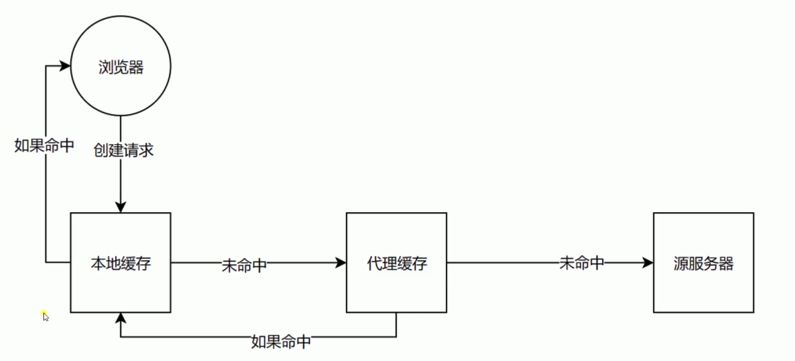
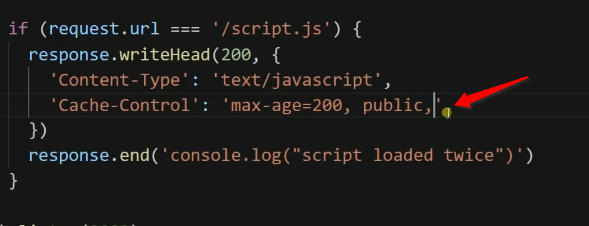
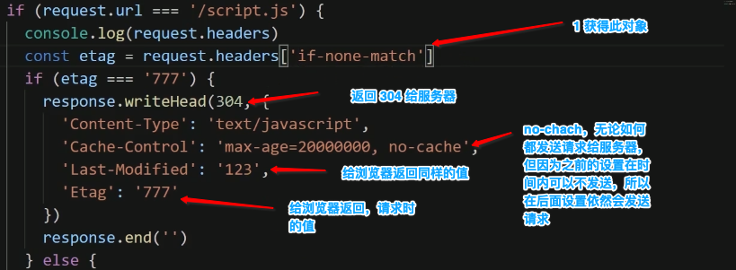

# 缓存

--- 这些头都是符合规范的提醒, 不是强制的

> Cache-Control :  设置规则,后面会覆盖前面相同的设置,不同的设置之间用逗号分隔

--- 一下都是值

## 可缓存性

> public: HTTP 允许请求过程中所有的节点都可以缓存我这次请求产生的数据
>
> private: 只有发起请求的浏览器可以缓存数据
>
> no-cache: HTTP 经过的任何节点都不可以缓存

## 到期

> max-age = <seconds> 缓存的数据保存多少秒后到期,到期后,在发送一次请求获取新的数据
>
> s-maxage = <seconds> 与max-age效果一样,但是针对代理服务器设置的
>
> max-stale= <seconds>  请求方的缓存过期后,只要还在max-stale的期限内,依然使用过期缓存不去源服务器请求数据 ( 这个在浏览器中用不到,浏览器不会主动设置这个头 ,只有发起端设置有用,在服务器返回端是没有用的 )

## 重新验证

> must-revalidate : max-age 过期后我们去原服务端发送这个请求
>
> proxy-revalidate :  指定缓存服务器在过期去源服务器请求.
>
> 这两个基本不会遇到

## 其他

> no-store: 本地和代理服务器都不可以使用缓存
>
> no-transform :用在服务器, 禁止代理服务器改动数据,对数据进行压缩等操作

## 

# 问题

##  缓存造成的数据更新不及时

### 问题

> 本地浏览器访问服务器后,会缓存大量的文件, 当浏览器再次使用的时候会在缓存的时间内不向服务器请求数据,直接使用本地缓存,  当服务器的数据发生改变就不能同步到本地. 

### 解决

> 1. 给获得的文件打包, 获得一个哈希值,通过哈希值与服务器交互,服务器判断文件是否发生变更.如果没有,则设置响应头告诉浏览器一切没变,然后返回 null 
> 2. 浏览器根据响应头的返回结果,会自动填补数据给 HTTP 请求

---- 以下是服务器的设置,判断头部信息,获取其中的last-Modeified 与Etag 的值对比服务器上的数据. 一样则返回null 

**no-cache 与 no-stroe** 的区别: 设置为no-stroe 就是完全不管缓存,无论如何都获取最新的数据, 浏览器不会在意头部信息,然后根据304和头部信息决定是否使用缓存.

最后文件修改数据

## 验证头:

> 真实的情况验证会更高效合理,这里重点是提出了思路

last-Modified : 上次修改时间: 对比上次修改时间来确定资源是否更新

​		浏览器会带上 If-Modified-Since 或 If-Unmodified-Since 使用

Etag: 

