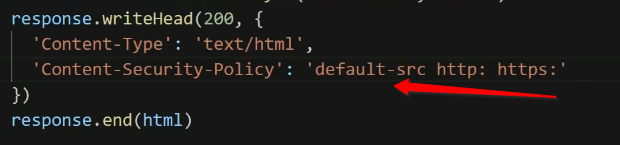
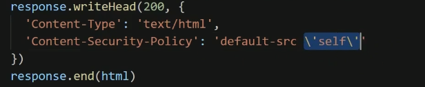
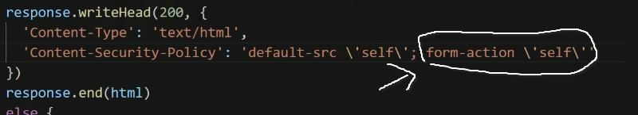
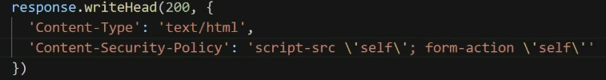
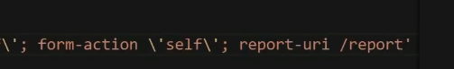
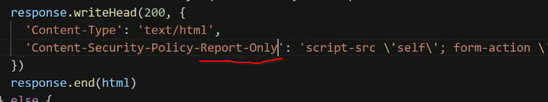
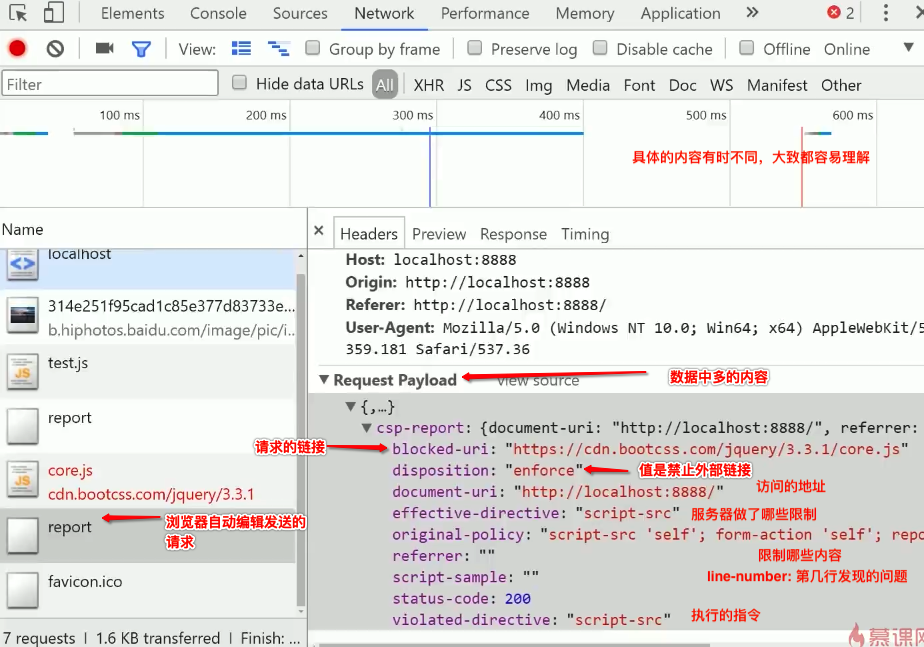
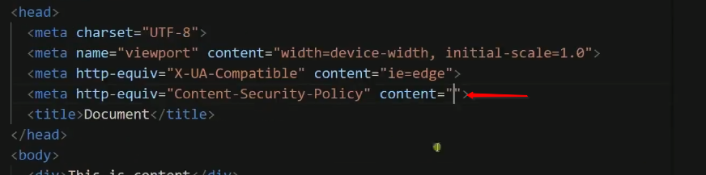
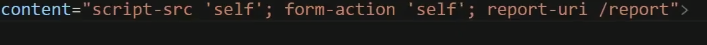

# CSP 安全策略

## Content-Security-Policy

> 作用: 
>
> 1. 限制客户端获取资源的方式,请求发送到哪里
> 2. 资源获取超限, 提供报告.
>
> 

## 方式:

**default-src**

1. 限制全局的src ,所有根链接,请求有关的东西
   1. 资源类型: 限制这些资源从哪里获取
      1. connect-src (请求目标地址) 
      2. img-src(图片从哪个网址进行加载) 
      3. media-src
      4. script-src
      5. font-src
      6. frame-src
      7. style-src

xss: 通过各种各样的方式向网页页面加载JS脚本的方式窃取用户信息(例如富文本), 此时用过服务器返回的头部信息中告知,网页不允许从HTML中加载JS脚本

操作方法:

1. 限制HTML中使用JS脚本,可以使用外链接

	2. 限制本网站之外的其他外链接

3. 限制表单仅可以向自己的网站提交内容

4. 仅限制某类,不使用全局限制; 这里仅限制js脚本

#### 汇报

> 当出现限制请求的时候,服务器希望得到告知

report-uri :是告知的意思

/report :是告知的地址是哪里

如果允许加载,仅是报告 则需要这样写

浏览器的做的事情

其中如果允许加载: dispostion: report  ; 每一个请求都会在name下生成一个report

### 直接在网页的meta中限制是一样的

做法:

效果是一样的, 这里是从HTML文件中声明; 但是最好是通过HTTP 的头部信息去限制, 在meta中会一些报错,有些限制是比如:  meta中不允许写report-url的

