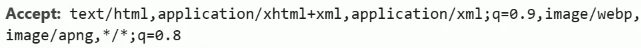
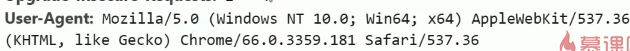
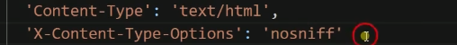
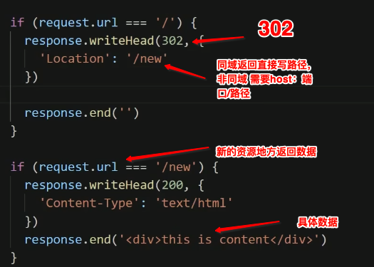
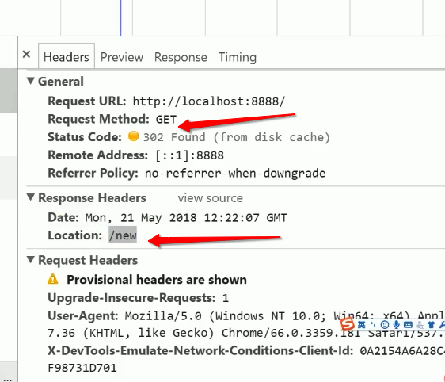

# 数据协商

> 浏览器可以通过请求头,说明想要的数据是怎样的,什么格式的等等,
>
> 服务器会根据请求内容,进行判断在决定给予什么类型的数据.

## 分类

### 请求

> 浏览器请求的时候或许的信息

Accept:想要什么样的数据

Accept-encoding:想要的数据用什么样的编码传输,主要限制服务端用什么方式进行数据压缩

Accept-language: 什么样的语言 , 世界上有很多不同的语言,所以希望获得语音是什么的

User-Agent:  浏览器想要展示的信息; 例如使用的具体什么设备,pc/ 移动/ 等等端口设备信息

### 返回

> 服务端返回信息 content

content-Type :  告诉客户端我返回的数据格式是怎样的一个格式.

content-encoding: 告知服务端具体用了那种数据压缩的格式

content-language: 告诉服务端,我给你的语言具体是哪种.  

### 解释:

> 数据格式,一般有客户端自动填写,下面的意思是这些格式都可以,我自己来处理.
>
> 如果:你只允许一种格式,就自己填写.但服务器未必给你,你指定的格式

> 压缩格式:

> 浏览器会根据你的系统语言自己动填写, 一个逗号为一个设置 ,
>
> q=0.9 是权重,权重越高优先级越高
>
> za-cn 中文  en 英语  zh-tw : 台湾

> 客户端信息
>
> 浏览器最早是网景公司 : Mozilla/5.0, 老的HTTP服务器仅支持这个头, 所以默认一般都是加上的,希望兼容老的服务器
>
> ( windows ****) 说的系统,和系统的架构 x64
>
> Applewebkit : 浏览器内核(苹果公司开发)
>
> (KHTML,lie Gecko)渲染引擎的版本,类似gecko(火狐浏览器渲染)
>
> Chrome*** : 浏览器
>
> Safri 是因为内核是苹果公司开发的,默认会加上

### 历史遗留问题

> 一般不会遇到: 最初的IE浏览器,会猜测或认为你的数据格式不对,然后自己认为数据格式是怎样的, 这样会产生一个问题有可能把文本文件变成可执行的文件,导致完全隐患.此时就需要服务器在返回数据的时候说明一下,请不要猜测.

## 重定向

> redirect : 重定向,如果一个url不用了,不应该马上废弃这个url, 而是在url 上告知客户端新的资源在什么地方. 否则就返回404了

​	**服务器的设置**

> 只有302的头才代表跳转,
>
> 302 代表本次是跳转到这个路径,下一次不一定是这个
>
> 301 代表这个链接永久调转到这个路径, 以后就不会去访问那个废弃地址了. 语义就是: 浏览器下次你直接去新路径就行

 客户端会变成:

