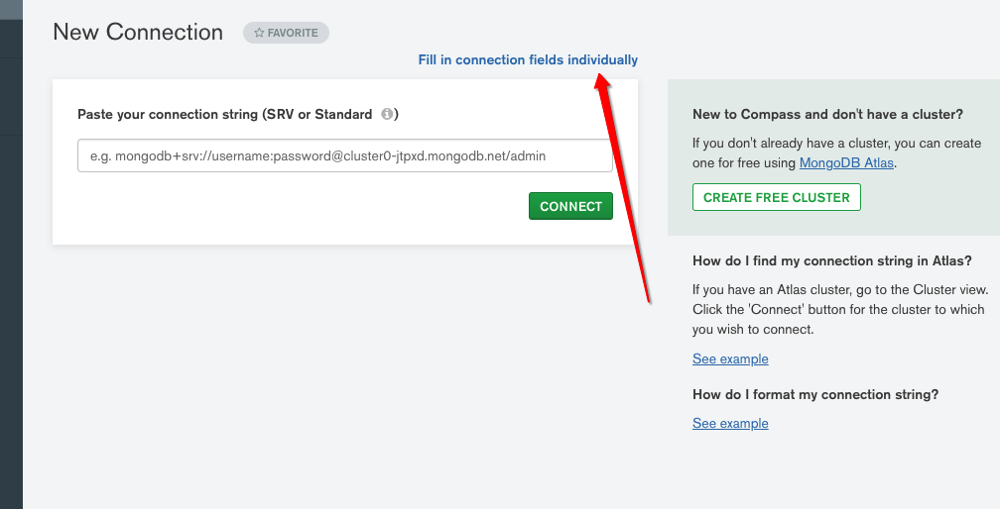
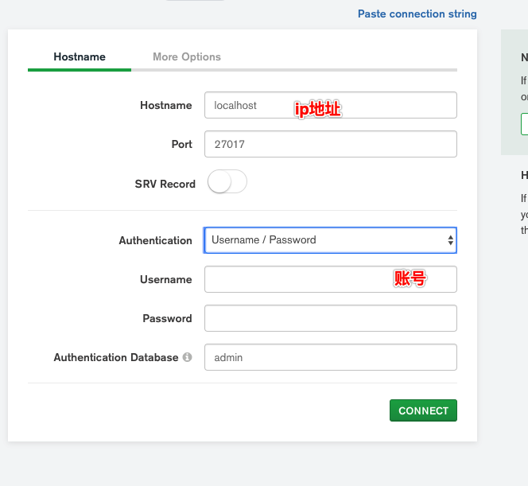

# mongoDB的下载安装和基础概念

## **0.  **数据库下载与安装

官网: https://www.mongodb.com/download-center/community

>  **在server下 下载对应版本，在tools下compass安装可视化界面**

~~~js
1.到官网下载对应版本的安装包 
	
	https://www.mongodb.com/download-center/community 内
	// 1.1 OS  contos 7 选 RHEL 7 
	// 1.2 Pacage 选 tgz

2. 在centos下内cd 到需要安装的目录下

	wget https://fastdl.mongodb.org/linux/mongodb-linux-x86_64-rhel70-4.2.3.tgz

3.解压缩 文件
	
	tar -zxvf mongodb-linux-s390x-rhel67-4.2.3.tgz 

4. 重命名文件
	
	mv mongodb-linux-x86_64-rhel70-3.6.5.tgz  mongodb

5.在mongodb目录下创建data 和logs目录
	
	mkdir data logs

6. 到bin目录下创建配置文件mongodb.conf文件

	mongodb3.0.6 版本之后需要配置mongodb.conf文件中的 bing_ip=0.0.0.0 之后才能远程访问，详细配置方法下文有解析

`@配置如下`
	/*  ERROR: child process failed, exited with error number 
	#1 配置文件内路径错误(可能是配置信息错误，找不到配置文件对应的目录报错：不要使用-f 来启动数据库s)
	dbpath = /opt/mongodb3.6/data #数据文件存放目录
	logpath = /opt/mongodb3.6/logs/mongodb.log #日志文件存放目录
	port = 27017  #端口
  fork = true  #以守护程序的方式启用，即在后台运行
  # nohttpinterface = true  这个配置需要去掉，不然会出现一个如下错误
  # Error parsing INI config file: unrecognised option 'nohttpinterface'
  auth=true #开启权限认证，2.6版本前向后兼容可以用
  #security:         
  #2.6版本后开启权限认证，空格！: enabled空格！
  #authorization: enabled
  bind_ip=0.0.0.0  #任何ip都可以访问
  */

7. 启动 - 在mongo文件的bin目录下
	
  ./mongod -f ./mongodb.conf

#windows 启动服务的命令是： net start mongo

8、查看是否启动成功

	ps -ef|grep mongodb

9. 添加配置文件
	// 设置配置文件
	vim /etc/profile

	//在末尾添加以下内容
	export PATH="$PATH:/文件绝对路径/bin"

	// 保存后更新配置,或重启服务器
	source /etc/profile

#配置相关
在mongodb路径下执行bin/mongo进入mongodb控制台
1. 创建管理员并创建数据库
	1.1 use admin  //切换到管理员状态
  1.2 db.createUser({
    user: "myAdmin",
    pwd: "sl19870719",
    roles: [ 
      	{ role: "userAdminAnyDatabase", db: "admin" },
      	{ role: "readWriteAnyDatabase", db: "admin" },
      	{ role: "root", db: "admin" }
      	{ role: "授予角色", db: "数据库名" }  //此行仅用作说明,使用时删除
    	]
  	})

  //user 管理账号 ， pwd管理员密码 数据库
		
  	use 账户名

#注意: 远程登录需要开通端口

//设置数据存放地址

	mongod --auth --port 27017 --dbpath /data/db

// 登录
	
	mongo --port 27017 -u "myUserAdmin" -p "sl19870719" --authenticationDatabase "admin"

// 验证信息,第二步返回1 验证成功
	use admin
	db.auth("myAdmin","sl19870719")  

#该myAdmin用户只需管理创建用户和角色，设置权限。
~~~

  安装教程

https://www.runoob.com/mongodb/mongodb-osx-install.html

## 1. **启动/退出** **MongoDB**

~~~js
 `启动MongoDB`
	
// 在mongodb的bin目录下启动命令
    ./mongod -f ./mongodb.conf
// 在windows下的启动命令	
		net start mongoDB	
// 查看是否启动成功
		ps -ef|grep mongodb

`退出MongoDB`
	use admin;
	db.shutdownServer();
~~~

## 2.可视化工具连接

