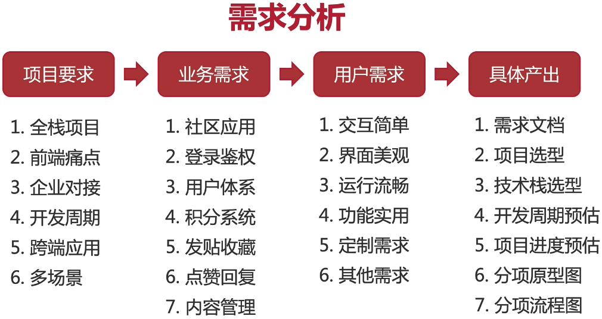

## 1 级灾难式处理方式

1. 没有经过思考就开始做
2. 照单全收，累死自己
3. 未沟通/确认用户: 和用户太熟，合作次数太多。没有确认
4. 放羊式管理

## 需求分析的难点

1. 考虑功能实现 ，还要考虑时间/成本
2. 形成需求文档，用户回馈确认
3. 引导用户的需求，创造用户需求: 极致模范乔布斯

## 需求变更

### 来自客户

1. 考虑是否合理
2. 是否是项目范围内的变更，对主体业务是否有影响
3. 明确需求变更的流程，确定需求变更

### 产品汪变更

1. 沟通是王道
2. 会哭有奶吃
3. 引导需求
4. 自我挑战, 处理合理更改

